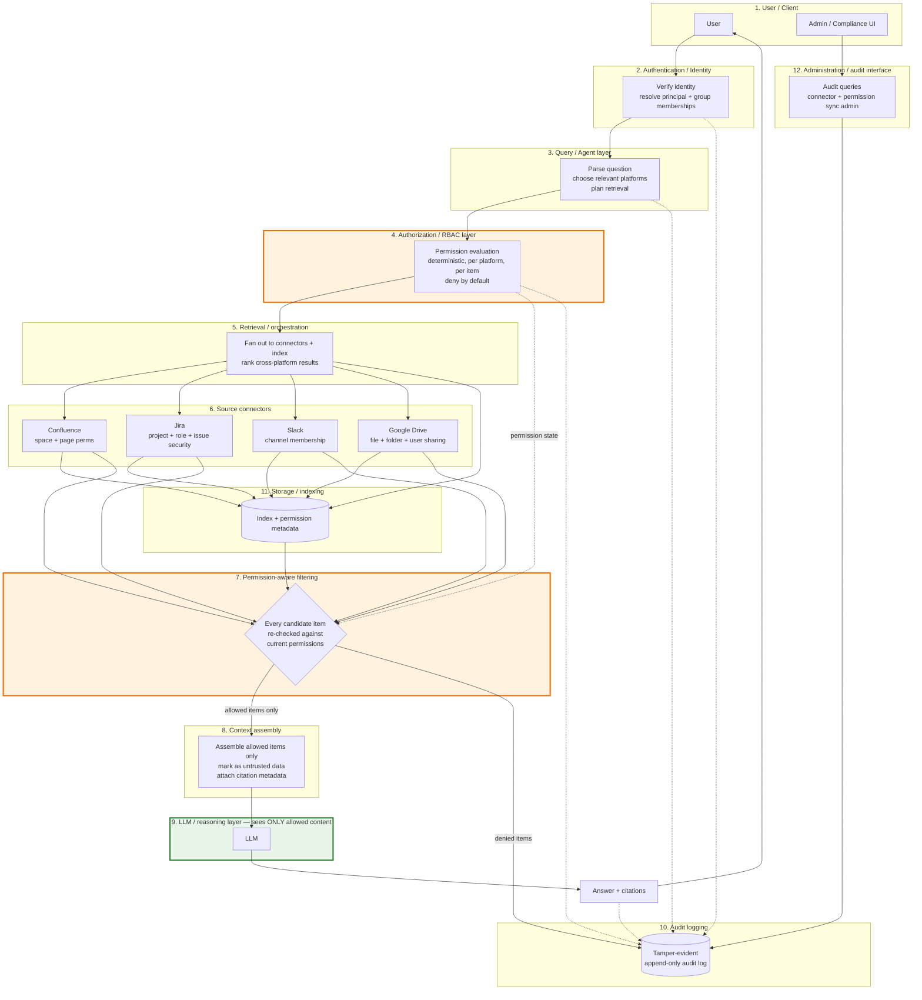

# ARCHITECTURE.md

> **STATUS: INITIAL / SUBJECT TO CHANGE.**
> This document describes the *shape* of the system and the questions the team
> must answer. It does not describe a decided architecture. No database, vector
> store, framework, LLM provider or cloud service has been chosen; those are
> ADRs in [DECISIONS.md](DECISIONS.md). Anything concrete below is marked
> `ASSUMPTION` or `OPTION`.

## 1. The one thing that must be true

**Unauthorized content never enters the LLM context.**

Every other design choice serves this. The security boundary is:

```
USER
  → AUTHENTICATION        (who is asking, verified)
  → AUTHORIZATION         (what may this identity see, per platform, right now)
  → PERMISSION-AWARE      (retrieve only from what is allowed; re-check what
    RETRIEVAL              was retrieved; drop anything not allowed)
  → CONTEXT ASSEMBLY      (only allowed items; treated as untrusted data)
  → LLM                   (reasons over allowed context only; decides nothing
                           about authorization)
  → ANSWER + CITATIONS    (grounded in the allowed items; audited)
```

Authorization is evaluated **left of the LLM** by deterministic code that
knows the user's identity. The LLM sits inside a box that only ever receives
already-filtered content. The audit log observes every stage.

## 2. Diagram (conceptual, not implementation)



Reading the diagram: the orange boxes (authorization and filtering) are the
trust boundary. Nothing reaches the green box (the LLM) without passing through
them. The audit log receives events from every stage, including denials.

The hackathon submission requires a **trust-boundary diagram** as a
deliverable. A refined version of the above will live in
[docs/architecture/](docs/architecture/) once the design is agreed.

## 3. Layers and the questions each one raises

Each layer below lists its responsibility, what it must never do, and the open
questions the team must resolve. Nothing here is decided.

### 3.1 User / Client
Responsibility: let a user ask a natural-language question and see an answer
with citations; let an admin or compliance officer query the audit trail.
Open: web UI, CLI, chat-platform bot, or API only? How are citations shown
(links back to the source item)? What does a "nothing found" response look
like so it does not leak existence (INV-5)?

### 3.2 Authentication / Identity
Responsibility: establish *who* is asking, and map that identity to the
identities the source platforms know (Confluence user, Jira user, Slack member,
Drive account).
Must never: allow retrieval without a verified identity (INV-3).
Open: how is identity established in the prototype? How are the four platform
identities linked to one principal? Is group membership resolved here or in
the authorization layer? `ASSUMPTION:` a simple, clearly-labelled login
suitable for a demo is acceptable, provided the identity is real input to
authorization, not decoration.

### 3.3 Query / Agent layer
Responsibility: understand the question, decide which platforms are relevant,
plan retrieval, and coordinate the answer.
Must never: hold authority over authorization; execute instructions found in
retrieved content.
Open: is the planner an LLM call, rules, or both? What tools may it call?
How is prompt injection in the user's query handled?

### 3.4 Authorization / RBAC layer
Responsibility: given a principal and an item (or a scope), decide allow or
deny, deterministically, and explain why.
Must never: be bypassed, flatten platform semantics into a lossy global role,
or defer the decision to the model (INV-2, INV-4).
Open: **Where exactly is authorization evaluated?** Options: (a) as a
pre-filter on the index query, (b) as a post-filter on candidates, (c) both,
with a live check against the source platform for anything that will reach the
LLM. **How are source-platform permissions represented?** Per-platform
evaluators behind one interface versus a translated common model. **How do we
handle permission changes after ingestion**, and **how do we guarantee stale
permissions do not leak** (INV-8)?

### 3.5 Retrieval / orchestration layer
Responsibility: fan out to the relevant platforms and/or index, gather
candidates, rank across platforms, and hand candidates to filtering.
Must never: return anything to context assembly that has not been filtered.
Open: **How do we retrieve across multiple platforms** and rank heterogeneous
results? Live API calls, a pre-built index, or a hybrid? **What happens when
one source system is unavailable**: partial answer with a warning, or refuse?

### 3.6 Source connectors
Responsibility: fetch content and permission data from each platform, exposing
each platform's native permission semantics rather than a simplified version.
Must never: hide or approximate permission information.
Open: which connectors are real and which are mocked for the hackathon
(mocks must be labelled)? How do we get realistic permission structures for
the demo? Least-privilege credential scopes per connector.

| Platform | Native permission semantics to preserve |
|---|---|
| Confluence | space-level and page-level restrictions, including named-individual page restrictions |
| Jira | project permission schemes, project roles, issue-level security levels |
| Slack | public vs private channel membership, DMs, workspace boundaries, retention |
| Google Drive | per-file and per-folder sharing (view / comment / edit), shared drives vs personal, external sharing |

### 3.7 Permission-aware filtering
Responsibility: the last gate before the LLM. Every candidate is checked
against the principal's *current* permissions; anything not allowed is dropped
and the denial is audited.
Must never: let an unchecked item through, or let a denial be visible to the
asker in a way that leaks existence.
Open: how is "current" defined and achieved within the freshness window?
Is this a re-check against the live platform, against recently synced
permission metadata, or both? What is the cost budget per query?

### 3.8 Context assembly
Responsibility: build the LLM input from allowed items only, attach citation
metadata, and mark content as untrusted data.
Must never: include anything not in the allowed set; include secrets or other
users' data (INV-1, INV-9).
Open: **How do we prevent retrieved content from becoming prompt injection?**
Delimiting and labelling content as data, restricting what the model can do,
and never letting model output feed back into authorization are the starting
points. What context-size limits and truncation rules apply?

### 3.9 LLM / reasoning layer
Responsibility: answer the question using only the provided context; cite;
say when the context does not contain an answer.
Must never: decide authorization; be given anything in section 3 of
SECURITY.md ("What the LLM must never see").
Open: provider and model (ADR-006). **How do we mitigate hallucination and
leakage of training-data content?** Grounding instructions, citation
verification, refusal on empty context, and possibly a second check that every
cited item was in the allowed set. **What exactly does the LLM never see?**

### 3.10 Audit logging
Responsibility: record, for every meaningful action, who, what, when and the
authorization decision, in a form an auditor can trust and query.
Must never: be silently skippable; be modifiable without detection (INV-6,
INV-7).
Open: **What exactly gets written**: identity, timestamp, query, candidate IDs,
per-item decision and reason, retrieved IDs, answer (or hash / reference),
model and prompt version? **How do we make it tamper-evident**: hash chain,
signatures, append-only store, external anchoring? **How do we handle failed
authorization** in the log versus in the answer? How are audit records
themselves access-controlled?

### 3.11 Storage / indexing
Responsibility: hold indexed content and its permission metadata so retrieval
is fast and filtering is possible.
Must never: become a way to bypass the source platform's permissions.
Open: **How are documents indexed** (full text, chunks, embeddings)? **How are
embeddings associated with permission metadata** so that a chunk always
carries enough to be authorized or dropped? **How do we handle stale data**:
what is the freshness window, and how is it achieved (polling, webhooks,
hybrid)? Is a vector store needed at all for the MVP?

### 3.12 Administration / audit interface
Responsibility: let a compliance officer run queries like "everything user X
accessed in space Y in the last 30 days"; let an admin manage connectors and
trigger permission sync.
Must never: expose content the admin themselves may not see.
Open: minimum viable form (page, CLI, API)? Who may use it?

## 4. Cross-cutting questions for the team

These are the questions the design must answer. Record answers as ADRs.

1. Where is authorization evaluated, and how many times per query?
2. How are source-platform permissions represented without flattening?
3. How do we handle permission changes after ingestion?
4. How do we guarantee stale permissions do not leak content?
5. How are documents indexed?
6. How are embeddings (if used) associated with permission metadata?
7. How do we retrieve and rank across multiple platforms?
8. How do we prevent retrieved content from becoming prompt injection?
9. What exactly gets written to the audit log?
10. How do we make audit logs tamper-evident?
11. How do we handle failed authorization, in the answer and in the log?
12. How do we handle stale data, and what freshness window do we commit to?
13. What happens when one source system is unavailable?
14. How do we show citations to users?
15. What data should the LLM never see?

## 5. Guidance for the first vertical slice

Not a decision, a suggestion to keep the team from overbuilding:

- One asker persona, one negative persona, one compliance persona.
- Two platforms first (the pair that best shows cross-platform assembly and a
  clear permission contrast), the other two added only after the core loop
  works end to end.
- Authorization, filtering and audit logging built as one small, well-tested
  module from day one. Retrofitting them is the classic failure mode.
- Every scenario in `docs/hackathon/challenge.md` section 3 becomes a test
  before it becomes a demo step.

## 6. What this document deliberately does not contain

Technology choices, service names, schemas, API designs, and deployment
topology. Those belong in ADRs after team discussion.
