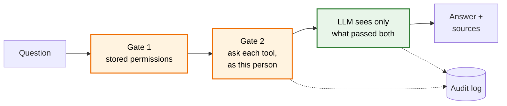

# KnowBuddy

**Ask your company's tools a question. See only what you're allowed to.**

KnowBuddy answers questions from a company's Slack, Google Drive, Jira and Confluence, with citations, using only
what the person asking can already see in those tools. Content they may not see never reaches the AI model, and every
question and admin action goes into a tamper-evident audit log.

Built for the **Tencent Cloud AI CAN DO IT Hackathon Singapore 2026**, FinTech track, Aspire's challenge *"The
Internal Brain: Building a Context-Aware Enterprise Knowledge System with RBAC, Security Logging & Audit Trail"*.

## What it solves

The challenge's five scenarios, each worked through with real output in [FEATURES.md](docs/FEATURES.md):

| # | Scenario | Status |
|---|---|---|
| 1 | One answer from several tools, with citations | Works |
| 2 | Fresh within a stated window: content in about 5 minutes, or at once with "sync now" | Works; "synced N minutes ago" in the UI is planned |
| 3 | A restricted document stays invisible, and its existence isn't revealed | Works |
| 4 | A revoked permission applies on the very next question | Works |
| 5 | An admin can reconstruct what someone accessed, from a tamper-evident log | Works through the API; the Audit page is being wired |

## How it works



Deterministic code decides who may see what, twice, before the model is called: first from permissions copied from
each tool, then by asking each tool, as the person asking, whether they can still read each document. The model never
decides access. The full trust boundary, the parts and the trade-offs: [ARCHITECTURE.md](docs/ARCHITECTURE.md).

## Try it

- **Live demo:** coming with the deployment (planned 9–10 Oct, [DEPLOYMENT.md](docs/DEPLOYMENT.md)).
- **On your computer** (needs Git and Docker Desktop; details in [RUNNING.md](docs/RUNNING.md)):

  ```bash
  git clone <repo-url> && cd tencent-hackathon-fintech
  cp backend/.env.example backend/.env && cp frontend/.env.example frontend/.env
  ```

  Fill in the four settings in [RUNNING.md](docs/RUNNING.md) §2, then:

  ```bash
  docker compose up --build
  ```

  Then, in a second terminal, load the demo data:

  ```bash
  docker compose run --rm backend python -m app.seed
  ```

  Open http://localhost:3000/login and sign in as Alice, Charlie or Priya to see what each may see.

## Documentation

| Guide | Read it to |
|---|---|
| [RUNNING.md](docs/RUNNING.md) | Run and use KnowBuddy, with demo personas or your own tools |
| [FEATURES.md](docs/FEATURES.md) | See each feature and scenario working, and how it works |
| [ARCHITECTURE.md](docs/ARCHITECTURE.md) | See how it's built: the trust boundary, the parts, the data model, the trade-offs |
| [SECURITY.md](docs/SECURITY.md) | Know the security rules and the tests that guard them |
| [TESTING.md](docs/TESTING.md) | Test a change, or check everything before submitting |
| [DEPLOYMENT.md](docs/DEPLOYMENT.md) | Put it on a server |
| [PROJECT.md](docs/PROJECT.md) | Know the goals, scope, roadmap and open questions |
| [CONTRIBUTING.md](CONTRIBUTING.md) | Change code, open a pull request, or propose a decision |

Every other page, where things live and a glossary: [docs/README.md](docs/README.md).

## Built with

Next.js · FastAPI · PostgreSQL with pgvector · Tencent Cloud TokenHub (`hy3` and embeddings) · Docker Compose on
Tencent Cloud Lighthouse. Why each was chosen: [DECISIONS.md](docs/decisions/DECISIONS.md).

## Team

| | Owns |
|---|---|
| Vincent Ong | Connectors, sync and companies |
| Liew Ze Wei | Frontend |
| Gabriel Wan | Query pipeline and audit log |

CodeBuddy and WorkBuddy usage evidence: [tool-usage.md](docs/hackathon/tool-usage.md). Submission deadline:
16 October 2026 ([checklist](docs/hackathon/submission.md)).
