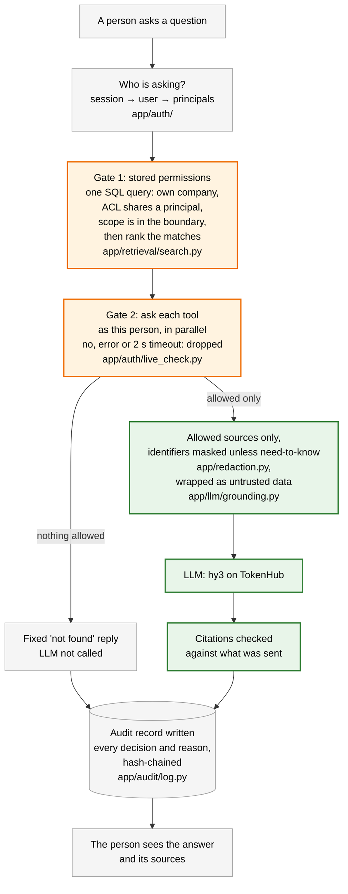
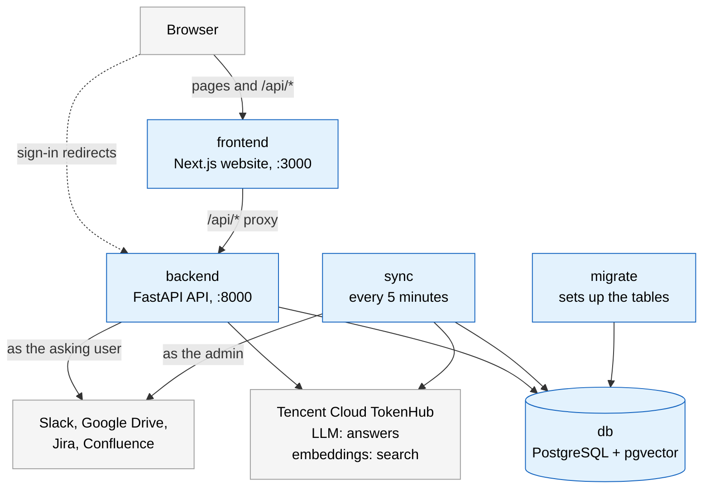
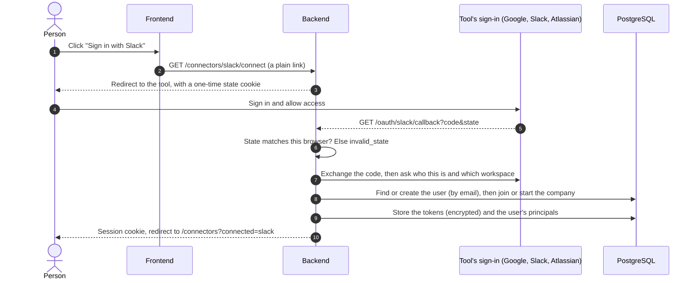
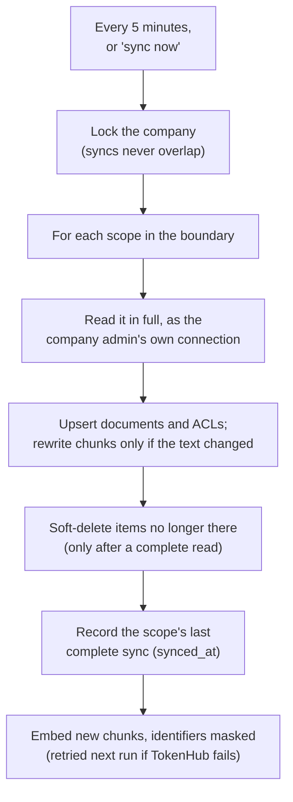
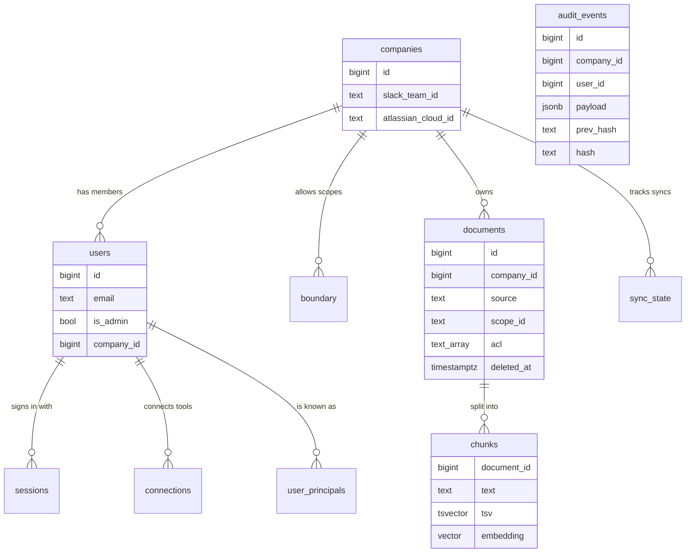

# How KnowBuddy is built

**For:** judges, new teammates, and anyone changing how the parts fit together.
**You'll:** see what each part does and why, how one question and one sign-in flow through them, and what we traded off.
**Not here:** API contracts and the exact query steps → [architecture/QUERY_PIPELINE.md](architecture/QUERY_PIPELINE.md) ·
connectors in depth → [architecture/CONNECTORS.md](architecture/CONNECTORS.md) · the security rules → [SECURITY.md](SECURITY.md) ·
why each choice was made → [decisions/DECISIONS.md](decisions/DECISIONS.md).

**Contents:** 1. In one paragraph · 2. The trust boundary · 3. The parts · 4. One question, step by step ·
5. Signing in and companies · 6. Sync · 7. Data model · 8. Trade-offs · 9. The design questions, answered ·
10. Deep dives

## 1. In one paragraph

KnowBuddy answers questions from a company's Slack, Google Drive, Jira and Confluence, using **only what the person
asking may already see**. One rule shapes everything: **content a person may not see never reaches the LLM.**
Deterministic code decides who may see what, twice, before the LLM is called: once from permissions stored at sync
time, and again by asking each tool, as that person, at question time. The LLM only ever receives what passed both,
and it never decides access. Every question and every admin action is written to a tamper-evident audit log.

| Part | Built with | Why it exists |
|---|---|---|
| Website | Next.js, Tailwind, shadcn/ui | Where people sign in, connect tools, ask questions and (as admin) review the audit log |
| API | FastAPI (Python) | Signs people in, enforces permissions, runs the question pipeline, writes the audit log |
| Sync worker | Python, same code as the API | Copies each company's chosen content and its permissions every 5 minutes, so search is fast |
| Database | PostgreSQL with pgvector | Documents, permissions, search indexes and the audit log in one place, kept consistent by transactions |
| LLM and embeddings | Tencent Cloud TokenHub (`hy3`, `kinfra-text-embedding-0.6b`) | Writes the answer from the allowed sources; turns text into vectors for search by meaning |
| Hosting | Docker Compose, one Tencent Cloud Lighthouse server | The same five containers locally and live (ADR-008, [DEPLOYMENT.md](DEPLOYMENT.md)) |

## 2. The trust boundary

This is the diagram the challenge asks for. The two orange steps are the gates: deterministic code that knows who
is asking. The green steps are the LLM's side, which only receives what passed both gates. The audit record is
written before the reply is sent.



| Layer | Does | Must never |
|---|---|---|
| Identity | Turns the session cookie into a user, and the user into their principals in each tool | Allow a question without a verified session (INV-3) |
| Gate 1: stored permissions | Searches only documents of the user's own company, inside the admin's boundary, whose ACL includes one of the user's principals | Rank or return anything before that filter: the filter runs inside the same query |
| Gate 2: live check | Asks each tool, as the user, whether they can still read each candidate | Let anything through on doubt: an error or a timeout is a "no" |
| Context assembly | Wraps each allowed source as untrusted data, with short labels instead of raw IDs | Include anything not allowed, other users' data, or secrets (INV-1, INV-9) |
| LLM | Answers only from the sources it was given, citing them | Decide who may see what (INV-2) |
| Answer check | Drops citations to anything not sent; with no valid citation, returns the fixed "not found" reply | Reveal whether a restricted document exists: "not found" looks the same either way (INV-5) |
| Audit log | Records the question, every candidate with its decision and reason, what was sent, the answer and timings | Be changed silently: records are hash-chained and the app's database login can only add them (INV-7) |

## 3. The parts

The five containers (blue), the outside services (grey), and what talks to what.



What each backend module does: [backend/README.md](../backend/README.md).

- **The browser only talks to the frontend**, except during sign-in: the tools' sign-in pages must redirect to the
  backend (`/connectors/{id}/connect` and `/oauth/{provider}/callback`), which then returns the browser to the frontend.
- **The frontend decides nothing.** It forwards the session cookie through its `/api` proxy and shows what the
  backend returns ([architecture/FRONTEND.md](architecture/FRONTEND.md)).
- **Two database logins:** `migrate` uses the owner; `backend` and `sync` log in as `knowbuddy_app`, which can read
  and add audit records but never change or delete them (migrations 0006 and 0007).
- **Many companies share one deployment.** Every query, sync and audit search is limited to one company.

Any pull request that adds, removes or rewires a part updates this diagram.

## 4. One question, step by step

```mermaid
sequenceDiagram
    autonumber
    actor P as Person
    participant FE as Frontend
    participant API as Backend: query pipeline
    participant DB as PostgreSQL
    participant T as Tools (Slack, Drive, Jira, Confluence)
    participant LLM as TokenHub (hy3)

    P->>FE: Ask a question
    FE->>API: POST /api/query {question}, cookie forwarded
    API->>DB: Session → user → principals
    API->>LLM: Embed the question (keyword search only if this fails)
    API->>DB: Search own company, ACL and boundary, top 20 documents
    API->>T: Live check as this person, in parallel, 2 s timeout
    alt Nothing allowed
        API-->>API: Fixed "not found" reply, LLM not called
    else Some sources allowed
        API->>LLM: Allowed sources, identifiers masked, as untrusted blocks (≤ 12,000 characters)
        LLM-->>API: Answer citing [S1], [S2]…
        API-->>API: Drop citations to anything not sent; mask identifiers the model was not shown
    end
    API->>DB: Add one hash-chained audit record (committed before replying)
    API-->>FE: Answer, sources (with synced_at), audit id
    FE-->>P: Answer, Sources list, Ref #
```

No database connection is held while TokenHub or a tool is called: the search and the audit record are two short
transactions. Exact contracts and every field: [architecture/QUERY_PIPELINE.md](architecture/QUERY_PIPELINE.md).

## 5. Signing in and companies

There is no password. Signing in means connecting a tool: its own sign-in proves who you are (ADR-002).



- **Companies.** The first full member (not a guest) of a new Slack workspace starts its company and becomes its
  admin. Later sign-ins from that workspace join it. Atlassian never starts a company (it can't tell a contractor
  from an employee): the admin adds the company's Atlassian site by connecting Jira, and sign-ins from that site
  join. Google names no company. A person with no company sees nothing.
- **One person, one company.** A sign-in that would move someone to another company, or claim an account that
  belongs to someone else, is refused (`no_company`, `account_mismatch`).
- **Sessions** last 12 hours. Only a hash of the session token is stored, and the cookie is httpOnly.
- In development, Slack is connected by pasting a token, because Slack only redirects to https addresses.

## 6. Sync



New and edited content appears within about 5 minutes (ADR-005). **Revocations don't wait for sync**: the live check
applies them on the very next question (ADR-003). Every answer's sources carry `synced_at`, so stale content is
labelled rather than hidden. Details: [architecture/CONNECTORS.md](architecture/CONNECTORS.md).

## 7. Data model

Ten tables, created by numbered migrations in `backend/migrations/versions/`.



| Table | Written by | The rule that matters |
|---|---|---|
| `companies` | The first full Slack member's sign-in | Every document, boundary scope and user belongs to exactly one |
| `users` | Sign-in | One person, one email, one company; `is_admin` for the company's admin |
| `sessions` | Sign-in | Stores a hash of the token, never the token; expires after 12 hours |
| `connections` | Sign-in | Tokens are encrypted (`TOKEN_ENCRYPTION_KEY`); never sent to the browser or the LLM |
| `user_principals` | Sign-in | A person's identities in each tool; search matches them against `documents.acl` |
| `boundary` | Admin (`PUT`/`DELETE /api/admin/boundary/…`), audited | Content outside it is never synced or searched |
| `documents` | Sync | `acl` may list extra people but must never leave out a real reader; deleted items are soft-deleted (`deleted_at`) |
| `chunks` | Sync | Pieces of at most 2,000 characters, with full-text and vector indexes |
| `sync_state` | Sync | Each scope's last complete sync, shown as `synced_at` |
| `audit_events` | Every question and admin action | Read-and-add only for the app; each record holds its company and the previous record's hash. No foreign keys, so the log outlives a deleted company |

## 8. Trade-offs

| We chose | Over | Because | What it costs |
|---|---|---|---|
| PostgreSQL for documents, vectors, full-text and ACLs | A separate search engine or vector store | One transaction keeps content and permissions consistent; one thing to run | Search at very large scale would need more; not our corpus size |
| Polling every 5 minutes, plus "sync now" | Webhooks | No public https endpoint or signature checks needed; works locally | New content can take up to ~5 minutes to appear |
| Re-checking with each tool at question time | Trusting stored permissions alone | Revocations apply on the very next question | Up to 2 s added per question; a tool outage makes answers less complete, never leaky |
| One role for admin and compliance | Separate roles | One fewer persona to build and demo (ADR-007) | No separation of duties; mitigated because admin actions are themselves in the hash chain |
| Admin = first full Slack member; Atlassian only joins | First sign-in from any tool | Atlassian can't tell a contractor from an employee | Any full Slack member who signs in first becomes admin |
| Many companies in one deployment | One deployment per company | The product serves any company that signs up | Every query must filter by company; anyone with a Slack workspace can start one |
| Signing in by connecting tools | An app username and password | The tools' own sign-in proves identity; nothing to store or reset | Sign-in depends on the tools' OAuth apps and their review processes |
| A hash chain inside PostgreSQL | An external ledger | Simple to build, verify and demo | Someone with owner access could rewrite and re-hash the chain; the chain head should be noted outside |

## 9. The design questions, answered

Before building, the team listed the questions the design had to answer. Each is now settled:

| # | Question | Answer | Decided in |
|---|---|---|---|
| 1 | Where is authorization evaluated, and how many times? | Twice before the LLM: in the search query (stored ACLs, company, boundary), then by asking each tool as the user | ADR-003 |
| 2 | How are tool permissions represented without flattening? | As each tool's own principals (`slack:user:…`, `slack:members`, `google:user:…`, `google:domain:…`, `atlassian:user:…`), matched against each document's ACL; the live check uses the tool's own rules | ADR-003 |
| 3 | How are permission changes after ingestion handled? | The live check on every question; the next sync refreshes stored ACLs | ADR-003, ADR-005 |
| 4 | How do we make sure stale permissions never leak? | Stored ACLs only narrow the search; the live check has the final say, and doubt means "no" | ADR-003 |
| 5 | How are documents indexed? | Split into chunks of up to 2,000 characters, with PostgreSQL full-text and pgvector (HNSW) indexes | ADR-005 |
| 6 | How are embeddings tied to permissions? | Chunks belong to a document; the permission filter runs in the same query as the vector search | ADR-005 |
| 7 | How do we retrieve and rank across tools? | One hybrid search over all tools, keyword and meaning merged by rank (reciprocal rank fusion) | ADR-004, ADR-005 |
| 8 | How do we stop retrieved content becoming prompt injection? | Only allowed content is sent, wrapped as labelled untrusted data; the model can't act or call tools; citations are checked | ADR-006 |
| 9 | What goes into the audit log? | Who, when, the question, every candidate with its decision and reason, what was sent, the answer, citations, model and timings, plus restricted matches | ADR-007 |
| 10 | How is the audit log made tamper-evident? | A hash chain per company, a database login that can only add records, and a verify action | ADR-007 |
| 11 | How is failed authorization handled? | Silently filtered for the asker ("not found", same as no result); recorded with its reason in the audit log | ADR-003, ADR-007 |
| 12 | What freshness window do we commit to? | About 5 minutes for content; the next question for revocations | ADR-005 |
| 13 | What if a tool is unavailable? | Its live checks fail, so its documents are dropped: a less complete answer, never a leak | ADR-003 |
| 14 | How are citations shown? | A Sources list under each answer: title, tool, link (http/https only) and when it was last updated. The API also returns when it was last synced (`synced_at`); showing that is planned | ADR-006, ADR-009 |
| 15 | What must the LLM never see? | Anything the asker may not see, credentials, other users' questions or answers, raw ACLs, audit internals | SECURITY.md §3 |

## 10. Deep dives

| Topic | Page |
|---|---|
| The query pipeline: every step and API contract | [architecture/QUERY_PIPELINE.md](architecture/QUERY_PIPELINE.md) |
| The frontend: pages, session gate, proxy, server actions, UI rules | [architecture/FRONTEND.md](architecture/FRONTEND.md) |
| Connectors: sign-in, tokens, sync, live checks, the document format | [architecture/CONNECTORS.md](architecture/CONNECTORS.md) |
| Setting up each tool's sign-in | [connectors/SETUP.md](connectors/SETUP.md) |
| Each tool's API and permission model | [connectors/reference/](connectors/reference/) |
| Security rules and the tests that guard them | [SECURITY.md](SECURITY.md) |
| Every decision, with its date and reasons | [decisions/DECISIONS.md](decisions/DECISIONS.md) |
