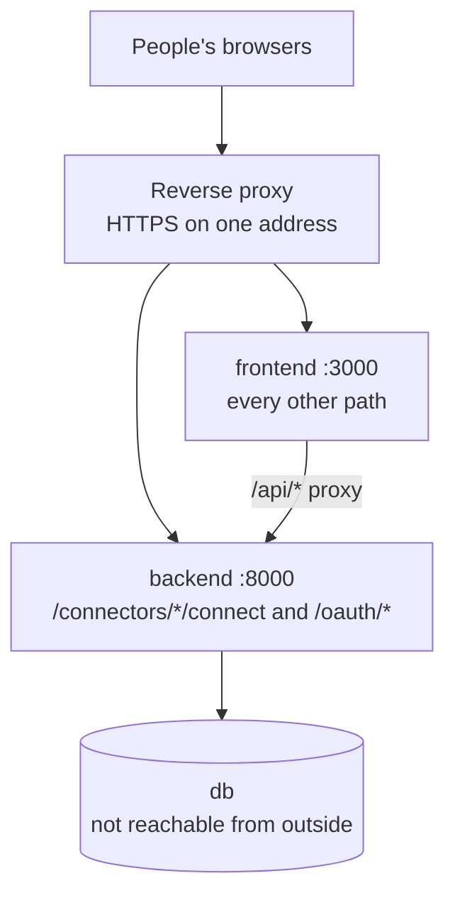

# Deploying KnowBuddy

**For:** whoever puts KnowBuddy on a server for the live demo.
**You'll:** set up one HTTPS address, the production settings and sign-in apps, deploy, and check it works.
**Not here:** running it locally → [RUNNING.md](RUNNING.md) · how it's built → [ARCHITECTURE.md](ARCHITECTURE.md).

> **Status (10 Oct): live at <https://knowbuddy.xyz>.** One Lighthouse server in Singapore (2 vCPU, 2 GB RAM, Docker
> image, 6-month plan) runs the setup on this page, with a Let's Encrypt certificate and Slack sign-in. Google Drive and
> Jira/Confluence sign-in are not configured on the server yet.

**Contents:** 1. The shape · 2. One HTTPS address · 3. Server settings · 4. Production sign-in apps · 5. Deploy and
update · 6. Check it works · 7. Never on the live site · 8. Automatic deploys

## 1. The shape

One Tencent Cloud Lighthouse server in Singapore runs the same five Docker Compose containers as a laptop, with the
database on the same server (ADR-008). A reverse proxy in front serves everything on one HTTPS address.



## 2. One HTTPS address

Frontend and backend must share one `https://` address, because:
- the backend sets the session cookie on its own address during sign-in, and the frontend must receive it;
- outside development the cookie is marked `Secure`, so browsers only send it over HTTPS.

The browser only goes to the backend directly during sign-in. Route these two paths to the backend, and everything
else to the frontend:

| Path | Goes to | Why |
|---|---|---|
| `/connectors/<tool>/connect` | backend `:8000` | Starts a tool's sign-in |
| `/oauth/<provider>/callback` | backend `:8000` | Where the tool returns after sign-in |
| everything else, including `/connectors` and `/api/*` | frontend `:3000` | The website; it forwards `/api/*` to the backend itself |

Only the proxy should be reachable from the internet. The proxy is **Caddy**, added by
[docker-compose.prod.yml](../docker-compose.prod.yml) with the routing above in [deploy/Caddyfile](../deploy/Caddyfile).
It gets a free TLS certificate from Let's Encrypt by itself. In production the backend and frontend ports are not
published at all, and the database never is.

**The server:** a Tencent Cloud Lighthouse instance in **Singapore** (no ICP filing needed outside mainland China), 2
vCPU and 4 GB RAM or more, Ubuntu 24.04 or the Docker CE image, with Docker Compose 2.24 or newer.
**Lighthouse firewall:** allow TCP 80, TCP and UDP 443, and SSH (22) only from your own IP address. Nothing else.

**The address** must be a domain name: Let's Encrypt does not issue certificates for bare IP addresses. Point a DNS
`A` record at the server's public IP before the first start. `ASSUMPTION:` the team uses a domain it controls; for a
quick test without one, a wildcard-DNS name such as `<ip-with-dashes>.sslip.io` resolves to the server and can get a
certificate, but shared names like this are more likely to hit Let's Encrypt rate limits.

## 3. Server settings

Create the `.env` files on the server, never in the repository. Use **new** secrets, never the ones from a laptop.
The script does this for you, generating every password and key and never printing them:

```bash
sh scripts/deploy/new-env.sh <your domain>
```

It writes `backend/.env`, `frontend/.env` and a top-level `.env` (the address for Caddy), and refuses to overwrite
existing files. Then fill in `LLM_API_KEY` and the sign-in apps (section 4) in `backend/.env`. What it sets:

**`backend/.env`:**

| Setting | Production value |
|---|---|
| `APP_ENV` | `production`. Development mode refuses to start on any address but `localhost`, so its persona sign-in can never be reachable on a server |
| `APP_URL`, `FRONTEND_URL` | Both `https://<your address>` |
| `POSTGRES_PASSWORD` | A new, long random password |
| `APP_DB_PASSWORD` | Another new, long random password, different from the one above |
| `TOKEN_ENCRYPTION_KEY` | A new key ([RUNNING.md](RUNNING.md) §2 shows how). Changing it later makes stored tokens unreadable, so everyone would have to connect again |
| `LLM_API_KEY` | The TokenHub key. Turn on pay-as-you-go so the free quota can't run out mid-demo (ADR-006) |
| Sign-in apps | The production client IDs and secrets (section 4) |

**`frontend/.env`:** `BACKEND_LOCAL_URL=https://<your address>`. The Slack token form disappears by itself, because
the backend's development routes don't exist in production.

## 4. Production sign-in apps

Production uses its own apps, never the ones from a laptop. `<APP_URL>` is `https://<your address>`.

1. **Google.** Repeat [connectors/SETUP.md](connectors/SETUP.md) §3 in a new project, with these changes:
   - **Audience:** **Internal** if the company uses Google Workspace (no review needed). Otherwise **External**, then
     publish the app, which needs Google's verification for Drive access.
   - **Authorized redirect URI:** `<APP_URL>/oauth/google/callback`.
   - Set `GOOGLE_CLIENT_ID` and `GOOGLE_CLIENT_SECRET`. Serving many companies needs **External**, published and
     verified: Drive is a restricted scope, so Google's verification includes a security assessment and takes weeks.
2. **Slack.** Create one app for the product, following [connectors/SETUP.md](connectors/SETUP.md) §4 steps 1 and 2.
   Then:
   - **OAuth & Permissions → Redirect URLs:** add `<APP_URL>/oauth/slack/callback`, and save.
   - **Basic Information → App Credentials:** copy the **Client ID** and **Client Secret**.
   - **Manage Distribution:** activate public distribution, so other companies' workspaces can install it.
   - Set `SLACK_CLIENT_ID` and `SLACK_CLIENT_SECRET`.
3. **Jira and Confluence: blocked.** Every user signing in to one company app needs **Distribution → Sharing**.
   Sharing asks whether the app stores personal data: it does (Atlassian account IDs), so Atlassian requires the
   [Personal Data Reporting API](https://developer.atlassian.com/cloud/jira/platform/user-privacy-developer-guide/)
   (report stored account IDs every 7 days, erase data for closed accounts). Build it first, and never tick its
   confirmation box before then.
4. **Companies** sign themselves up: the first full member to connect Slack from a new workspace creates the company
   and becomes its admin ([RUNNING.md](RUNNING.md) §5).

## 5. Deploy and update

Merges to main deploy themselves once section 8 is set up. By hand, on the server as the `ubuntu` user (never
`root`, or files in the repository end up owned by root):

```bash
sh ~/tencent-hackathon-fintech/scripts/deploy/update.sh
```

It switches to main, takes the latest commits, rebuilds what changed, removes unused images and waits for the backend
to be healthy. It refuses to run if a deploy is already running, or if someone changed main on the server itself. The
first deploy is different: run `docker compose -f docker-compose.yml -f docker-compose.prod.yml up --build -d` after
`new-env.sh` (section 3).

Always include both files on the server: without the second one, Caddy does not run and ports 3000 and 8000 are
published. The `migrate` service updates the database before the backend starts, and sets the app's database password
from `APP_DB_PASSWORD`. The `sync` service then syncs every company every 5 minutes. Every service restarts by itself
after a crash or a server reboot. To see what's happening: `docker compose ps` and
`docker compose logs proxy backend sync` (the proxy log shows the certificate being issued on first start).

Never run `docker compose down -v` on the server: it deletes the database, including the audit log.

## 6. Check it works

| Check | ✅ |
|---|---|
| `https://<your address>/status` | `db: ok` |
| `https://<your address>/login` | The Google, Slack and Atlassian sign-in buttons; **no** "Sign in as a seeded user" and **no** token form |
| Sign in with Slack | You land on Connections with "Connected Slack"; the browser shows the cookie as `Secure` |
| As the admin, set a boundary and run "sync now" | `docker compose logs sync` shows the scopes synced |
| Ask a question about that content | An answer with sources |
| `https://<your address>:8000` and `:3000` | Unreachable from outside (the firewall) |

Then record what was done, and the address, in this page.

## 7. Never on the live site

- Real company data or real people's content: the demo uses fictional, team-owned workspaces (ADR-004).
- Development mode, the demo personas or mock mode: they don't exist with `APP_ENV=production`.
- Any secret in the repository, a screenshot or the demo video.

## 8. Automatic deploys

[.github/workflows/deploy.yml](../.github/workflows/deploy.yml) runs after every merge to main (documentation-only
changes excepted), and from the **Actions** tab with **Run workflow**:

1. **Test:** the backend tests (Postgres in Docker) and the frontend tests and production build. Any failure stops here,
   so a broken merge never reaches the server.
2. **Deploy:** GitHub connects to the server over SSH and runs `scripts/deploy/update.sh` (section 5).
3. **Check:** `https://knowbuddy.xyz/status` must report "Database ok".

**The deploy key can do one thing.** Its line in the server's `~/.ssh/authorized_keys` forces it to run the update
script, with no shell, port forwarding or terminal. Someone holding the key can only trigger a deploy of what is
already on GitHub's main.

**One-time setup** (until it's done, the workflow tests and skips the deploy with a warning):

1. On the server, as `ubuntu`, switch to main so the update script exists, then create the key with the forced command:

   ```bash
   cd ~/tencent-hackathon-fintech && git checkout main && git pull
   ```

   ```bash
   ssh-keygen -t ed25519 -N "" -C github-deploy -f ~/.ssh/github_deploy && echo "restrict,command=\"sh /home/ubuntu/tencent-hackathon-fintech/scripts/deploy/update.sh\" $(cat ~/.ssh/github_deploy.pub)" >> ~/.ssh/authorized_keys
   ```

2. Test it on the server itself: this must run a deploy and print "Deployed" (answer `yes` to the host-key question):

   ```bash
   ssh -i ~/.ssh/github_deploy ubuntu@localhost
   ```

3. In GitHub: **Settings → Secrets and variables → Actions → New repository secret**, three times:

   | Name | Value |
   |---|---|
   | `DEPLOY_HOST` | The server's public IP |
   | `DEPLOY_KNOWN_HOSTS` | The output of `ssh-keyscan -t ed25519 <IP>`; check its fingerprint matches `ssh-keygen -lf /etc/ssh/ssh_host_ed25519_key.pub` on the server |
   | `DEPLOY_SSH_KEY` | The whole output of `cat ~/.ssh/github_deploy` on the server, including the BEGIN and END lines |

4. Delete the private key from the server (GitHub now holds the only copy): `rm ~/.ssh/github_deploy`.
5. **Actions → Test and deploy → Run workflow** on main, and check all three steps pass.

**To stop automatic deploys:** delete the `github-deploy` line from `~/.ssh/authorized_keys` on the server. To replace a
leaked key: delete that line, then repeat steps 1 to 4.
