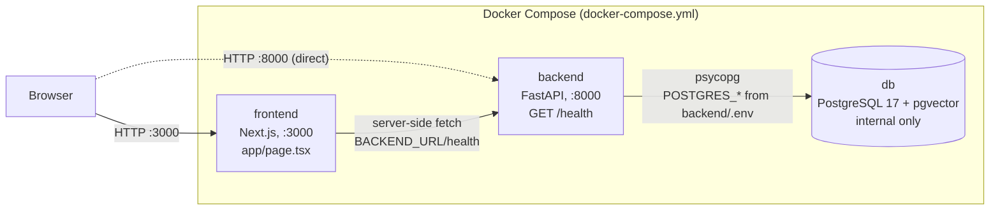

This file shows the architecture as it is built in the repository right now, not as it is planned. Planned designs belong in ARCHITECTURE.md and DECISIONS.md. The diagram shows only what exists in code and config: running services, frontend, backend, databases, external APIs, deployment targets, and how they connect. If something is not built, it is not in the diagram. Whenever a change adds, removes, or rewires a component, update the diagram in the same PR so it always matches the code. Keep this file to this paragraph plus one Mermaid diagram.

