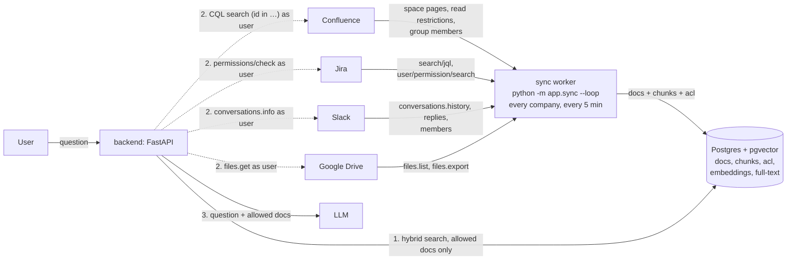

# Connectors

**For:** anyone changing how KnowBuddy signs people in, syncs content or checks permissions with the tools.
**You'll:** see how connecting, sync and live checks fit together, the HTTP and Python APIs, and the document format.
**Not here:** setting up each tool's sign-in app → [connectors/SETUP.md](../connectors/SETUP.md) · choosing the
boundary and syncing as an admin → [RUNNING.md](../RUNNING.md) §5 · each tool's API in depth →
[connectors/reference/](../connectors/reference/).

**Contents:** 1. How it fits · 2. The flow · 3. HTTP API · 4. Python API · 5. The document format ·
6. Sync · 7. Checking it works · 8. How we compare

## 1. How it fits

1. **Connect.** A user clicks **Connect** and signs in to the tool. The `connections` table stores their tokens, encrypted. The first connect creates the user (linked by email) and signs them in to the app: the same session as the rest of the API.
2. **Sync.** Every 5 minutes (or on **sync now**), `app/sync.py` reads each boundary scope as the company admin's own connection and writes `documents` and `chunks` (sections 5 and 6).
3. **Permissions.** Each connection writes the user's principals (section 5) to `user_principals`. Search keeps the user's own company's documents whose `acl` overlaps them (`app/auth/principals.py`). Then the live check re-asks each tool as that user (`app/connectors/live.py`), and has the final say.

Code: `backend/app/connectors/` (one module per source, each with `scopes`, `fetch` and `can_read`), `backend/app/sync.py`, `backend/app/companies.py`. Users, sessions and principals are in `backend/app/auth/`. Connectors depend on auth, never the reverse.

## 2. The flow



Solid arrows into the worker run on a timer. Dashed arrows run on every question.

1. **Ingest (sync worker, on a timer).**
   - **Built** (`app/sync.py`): one loop over every company. Every 5 minutes each boundary scope is listed in full, as the company admin, so every run refreshes every ACL and soft-deletes items that are gone. Text is downloaded only for items whose modified time changed. A failing scope is logged and skipped; the others still sync.
   - **Planned, not built:** a loop per source (so a slow source never delays the others), a `sync` fetching only items changed since the last run, and a slower `sweep` listing everything to catch permission changes and deletions.
   - **Races:** syncs of one company run one at a time (a Postgres advisory lock), so an older read never overwrites a newer one. A scope the admin removes during a sync is not written back.
   - **Staleness is visible:** each scope's last complete sync is stored (`sync_state`) and returned as `synced_at` on citations and `last_synced_at` in the admin boundary list. A scope that keeps failing keeps its old time, so stale content is labelled, never shown as current.

   Each item is saved as a document with an `acl` (the IDs of people allowed to read it, e.g. `slack:user:U024`) and its text split into chunks. Only chunks whose text hash changed are re-embedded.
2. **Search (backend, per question).** Hybrid search runs vector similarity plus Postgres full-text (for exact terms like `PAY-13`), merged by rank. It returns only chunks whose `acl` contains one of the asker's IDs.
3. **Live check (backend, per question).** For the top 20 results, the backend asks each source in parallel (2 s timeout) whether this user can still read the item. A "no", an error, a timeout or a deleted item drops it, so revocations apply on the very next question. Deletions do too for Drive (trashed files included), Jira and Confluence. Slack's check is per channel, so a deleted Slack message drops at the next sync (≤ 5 min).
4. **Answer.** Up to 10 documents that passed the live check go to the LLM.

The stored `acl` is the fast filter and the live check is the final say, so the
`acl` may include extra people but must never leave out a real reader.
Each tool's API and permission model: [connectors/reference/](../connectors/reference/).

## 3. HTTP API

Auth is the `ib_session` cookie (HttpOnly, 12 hours), set on first connect. Routes marked "user" return `401 {"detail": "Not signed in"}` without it.

- `{id}`: `drive`, `slack`, `jira` or `confluence`
- `{provider}`: `google`, `slack` or `atlassian`
- Unknown values return `404`.

| Request | Auth | Response | Errors |
|---|---|---|---|
| `GET /connectors` | optional | `200` list (below). All `connected: false` if signed out. | none |
| `GET /connectors/{id}/connect` | none | `302` to the tool's sign-in page | `503 "<provider> sign-in is not configured: set <VAR>"` |
| `GET /oauth/{provider}/callback` | none (called by the tool) | `303` to `{FRONTEND_URL}/connectors?connected=<provider>` | `303` to `…?error=access_denied`, `provider_error`, `no_company`, `missing_permission` (Google sign-in without Drive ticked), `invalid_state` or `account_mismatch` |
| `GET /connectors/{id}/ping` | user | `200 {"ok": true, "as": "<name or email>"}` | `404` not connected, `401` connect again, `502` tool API failed |
| `DELETE /connectors/{id}` | user | `204`. Also revokes the grant at Google or Slack. Jira and Confluence share one sign-in, so this disconnects both. | none |
| `DELETE /api/session` | optional | `204`, and clears the cookie (log out; `app/api/routes.py`) | none |
| `GET /api/admin/scopes/{id}` | admin | `200 [{"id", "title"}]`: channels, folders, projects or spaces the admin can see | `403` not an admin, `404` not connected |
| `GET /api/admin/boundary` | admin | `200` your company's boundary | `403` |
| `PUT /api/admin/boundary/{id}/{scope_id}` | admin | `{"title": "<name>"}` → `204`. Audited. | `403`, `404` unknown tool |
| `DELETE /api/admin/boundary/{id}/{scope_id}` | admin | `204`; its documents are hidden at once. Audited. | `403`, `404` |
| `POST /api/admin/sync` | admin | `202`: syncs your company now, in the background | `403` |
| `GET /api/admin/audit` | admin | `200 {"records": [...], "next_before_id"}`: your company's audit trail, newest first; filters `user`, `since`, `until`, `event_type`, `document`, `source`, `scope_id`, `before_id`, `limit` (ADR-007) | `403`, `422` bad filter |
| `POST /api/admin/audit/verify` | admin | `200 {"ok", "checked", "first_broken_id", "reason", "head"}`: recomputes your company's hash chain | `403` |
| `POST /api/dev/connectors/slack` | none. **Development only** | `{"token": "xoxp-…"}`: connects Slack like **Connect**, starts a session. `200 {"connected": "slack", "as": "<name>"}` | `400` token rejected, `403 no_company` workspace belongs to no company you can join, `409` account belongs to someone else, `503` not configured |

`GET /connectors` response:
```json
[
  {"id": "drive", "name": "Google Drive", "connected": true,
   "account": {"name": "<display name>", "email": "<email>"}},
  {"id": "slack", "name": "Slack", "connected": false, "account": null}
]
```

Errors use FastAPI's shape, `{"detail": "<message>"}`. Every route is also listed at http://localhost:8000/docs.

## 4. Python API

Use these inside FastAPI handlers. `user` is the app user's id (`int`).

```python
from fastapi import Depends, HTTPException
from app.api.deps import current_user           # 401 if not signed in
from app.auth.session import User
from app.db import Db                           # SQLAlchemy Engine
from app.connectors import atlassian, store

@router.get("/example")
def example(engine: Db, current: User = Depends(current_user)):
    user = current.id
    try:
        channels = store.client(engine, user, "slack").conversations_list(types="public_channel,private_channel")
        with store.client(engine, user, "jira") as jira:
            issues = atlassian.request("POST", "/rest/api/3/search/jql", http=jira, json={"jql": "order by updated"}).json()
    except store.NotConnected as e:
        raise HTTPException(404, "not connected") from e
    except store.ReconnectNeeded as e:
        raise HTTPException(401, "connect again") from e
```

**As the signed-in user** (`store.py`). Tokens are refreshed automatically.

`store.client(engine, user, source)` returns the API client for `source`:

| `source` | Returns |
|---|---|
| `slack` | slack_sdk `WebClient` |
| `drive` | Drive v3 service (`googleapiclient`). Call `.execute(num_retries=3)` on each request. |
| `jira`, `confluence` | `httpx.Client` for that product. Use it in a `with` block, through `atlassian.request(..., http=client)`, which retries 429/5xx and raises `httpx.HTTPStatusError` on other errors. |

It raises:
- `store.NotConnected` if the user hasn't connected that tool (or their Atlassian site lacks that product)
- `store.ReconnectNeeded` if the tool revoked the access

**Each source module** (`store.SOURCES[source]`: `slack`, `drive`, `jira`, `confluence`) takes a client from `store.client`:

| Function | Returns |
|---|---|
| `scopes(client)` | `[{"id", "title"}]`: channels, folders, projects or spaces that person can see |
| `fetch(client, scope_id, changed)` | the scope's documents (section 5), with ACLs. Text is downloaded only when `changed(source_id, updated_at)`; otherwise `text` is `None` |
| `can_read(client, ids)` | the `source_id`s that person can read right now. Denies by default: any error leaves the ID out. |

**Permissions:** `principals_for(conn, user)` (`app/auth/principals.py`) returns the ACL entries the user holds (section 5), from `user_principals`, plus `public`. The query pipeline's live check is `app/connectors/live.py`: it finds the asking user's connection from their principal and calls `can_read` as them.

**Rules:**
- Pass `engine`, not an open connection, to the `store.*` client functions: they commit token refreshes in their own short transaction.
- Never send tokens or raw tool errors to the browser.
- Don't add retry loops: the clients above already retry rate limits.

## 5. The document format (sync contract)

Each source's `fetch` yields one document per Drive file, Slack thread, Jira ticket or Confluence page, and `app/sync.py` writes it as one `documents` row (with its `chunks`) for the company. Tables: `migrations/versions/0002_core_schema.py` and `0005_companies.py`; contract: [QUERY_PIPELINE.md](QUERY_PIPELINE.md). The shape:

```jsonc
{
  "source": "drive",                      // drive | slack | jira | confluence
  "source_id": "<id in the tool>",        // Slack "<channel>:<ts>", Jira the numeric issue ID; unique per company
  "scope_id": "<boundary scope>",         // channel, top folder, project key or space ID
  "title": "<title>",
  "text": "<plain text>",
  "url": "<link that opens it in the tool>",
  "updated_at": "2026-10-01T05:00:00Z",   // UTC
  "metadata": {},                         // optional, per source; "need_to_know": handlers (ADR-010)
  "acl": ["google:user:<email>", "public"]
}
```

`acl` entries, the same strings connections write to `user_principals`:

| Principal | Meaning |
|---|---|
| `google:user:<email>` | That Google user (emails in lower case) |
| `google:domain:<domain>` | Everyone with a verified email on that domain |
| `slack:user:<slack user id>` | That Slack user (private channels) |
| `slack:members` | Every full member of the workspace (public channels). Guests never hold it. |
| `atlassian:user:<accountId>` | That Atlassian user. Groups and roles are expanded into users. |
| `public` | Anyone in the company: a Drive file shared with "anyone", or an unrestricted Confluence page. Held by every user (`principals_for`); search never crosses companies. |

An `acl` may include extra people but never leaves out a real reader: `can_read` removes the extras. Known widenings, all trimmed by the live check: a Drive group becomes its domain, Jira issue security levels are not applied, Confluence space permissions are not applied.

Not synced yet: Drive files in shared drives (Drive doesn't list their sharing), PDFs and Office files (no text extraction), and Google Docs over Drive's 10 MB export limit. Each is skipped and logged; the rest of the folder still syncs.

Field mappings per source are in §5 of [GOOGLE_DRIVE.md](../connectors/reference/GOOGLE_DRIVE.md), [SLACK.md](../connectors/reference/SLACK.md), [JIRA.md](../connectors/reference/JIRA.md) and [CONFLUENCE.md](../connectors/reference/CONFLUENCE.md).

## 6. Sync

How an admin chooses the boundary and runs a sync: [RUNNING.md](../RUNNING.md) section 5, step 3. Under the
hood, `docker compose up` starts the `sync` service, which repeats it every 5 minutes for every company; you can
also run one sync by hand with `docker compose run --rm backend python -m app.sync`. Chunks are embedded after each
run; if the LLM key is missing or TokenHub is down, keyword search still works and the vectors are filled in on a
later run.

## 7. Checking it works

Checks after connecting (session, encrypted tokens, principals, outsiders refused, revocations, disconnect, sign
out): [TESTING.md](../TESTING.md) section 4, "With your own tools". Unit tests: [TESTING.md](../TESTING.md) section 1.

## 8. How we compare

| | [Onyx](https://github.com/onyx-dot-app/onyx) | [PipesHub](https://github.com/pipeshub-ai/pipeshub-ai) | Ours |
|---|---|---|---|
| Services to run | Postgres, OpenSearch, Redis, object store, 2 model servers, background workers | Neo4j or ArangoDB, Qdrant, MongoDB, Redis, Kafka (large deployments) | Postgres + pgvector, one worker |
| New content | Polls every 30 min (default) | Scheduled and real-time indexing | Polls every 5 min |
| Deletes | Pruning every 30 days (default) | Connector sync | Next sync (≤ 5 min: every scope is read in full); the live check drops deleted Drive, Jira and Confluence items immediately |
| Permissions stored | ACL in the search index, synced from the source (Enterprise Edition only) | Users, groups and records in the knowledge graph | `acl` column next to the chunks, same transaction |
| Checked at question time | Index filter only | Claims access is "resolved when the query runs, against the source system's own permissions" | SQL filter, then a live check with each source |
| Revoked user loses access | After the next permission sync | At query time | Next question |

**What we take from them:** hybrid vector + keyword search (Onyx), and checking with the source at query time (PipesHub).

**What we skip:** a separate search engine, graph database and message queue. At this corpus size Postgres handles vectors, full-text and ACLs in one place, and one transaction keeps them consistent. Add OpenSearch or a queue only when Postgres search latency or worker throughput is measured to be the bottleneck.
