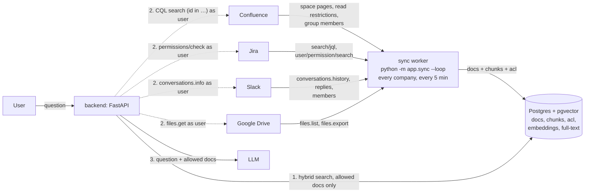

# Connectors architecture

## Diagram

Solid arrows into the worker run on a timer. Dashed arrows run on every question.

## How it works

1. **Ingest (sync worker, on a timer).**
   - **Built** (`app/sync.py`): one loop over every company. Every 5 minutes each boundary scope is listed in full, as the company admin, so every run refreshes every ACL and soft-deletes items that are gone. Text is downloaded only for items whose modified time changed. A failing scope is logged and skipped; the others still sync.
   - **Planned, not built:** a loop per source (so a slow source never delays the others), a `sync` fetching only items changed since the last run, and a slower `sweep` listing everything to catch permission changes and deletions.
   - **Races:** syncs of one company run one at a time (a Postgres advisory lock), so an older read never overwrites a newer one. A scope the admin removes during a sync is not written back.
   - **Staleness is visible:** each scope's last complete sync is stored (`sync_state`) and returned as `synced_at` on citations and `last_synced_at` in the admin boundary list. A scope that keeps failing keeps its old time, so stale content is labelled, never shown as current.

   Each item is saved as a document with an `acl` (the IDs of people allowed to read it, e.g. `slack:user:U024`) and its text split into chunks. Only chunks whose text hash changed are re-embedded.
2. **Search (backend, per question).** Hybrid search runs vector similarity plus Postgres full-text (for exact terms like `PAY-13`), merged by rank. It returns only chunks whose `acl` contains one of the asker's IDs.
3. **Live check (backend, per question).** For the top 20 results, the backend asks each source in parallel (2 s timeout) whether this user can still read the item. A "no", an error, a timeout or a deleted item drops it, so revocations apply on the very next question. Deletions do too for Drive (trashed files included), Jira and Confluence. Slack's check is per channel, so a deleted Slack message drops at the next sync (≤ 5 min).
4. **Answer.** Up to 10 documents that passed the live check go to the LLM.

The stored `acl` is the fast filter and the live check is the final say, so the
`acl` may include extra people but must never leave out a real reader.
Per-source API details: [docs/connectors/](../connectors/GUIDE.md) (setup and API in GUIDE.md, one page per tool).

## Comparison

| | [Onyx](https://github.com/onyx-dot-app/onyx) | [PipesHub](https://github.com/pipeshub-ai/pipeshub-ai) | Ours |
|---|---|---|---|
| Services to run | Postgres, OpenSearch, Redis, object store, 2 model servers, background workers | Neo4j or ArangoDB, Qdrant, MongoDB, Redis, Kafka (large deployments) | Postgres + pgvector, one worker |
| New content | Polls every 30 min (default) | Scheduled and real-time indexing | Polls every 5 min |
| Deletes | Pruning every 30 days (default) | Connector sync | Next sync (≤ 5 min: every scope is read in full); the live check drops deleted Drive, Jira and Confluence items immediately |
| Permissions stored | ACL in the search index, synced from the source (Enterprise Edition only) | Users, groups and records in the knowledge graph | `acl` column next to the chunks, same transaction |
| Checked at question time | Index filter only | Claims access is "resolved when the query runs, against the source system's own permissions" | SQL filter, then a live check with each source |
| Revoked user loses access | After the next permission sync | At query time | Next question |

**What we take from them:** hybrid vector + keyword search (Onyx), and checking with the source at query time (PipesHub).

**What we skip:** a separate search engine, graph database and message queue. At this corpus size Postgres handles vectors, full-text and ACLs in one place, and one transaction keeps them consistent. Add OpenSearch or a queue only when Postgres search latency or worker throughput is measured to be the bottleneck.
