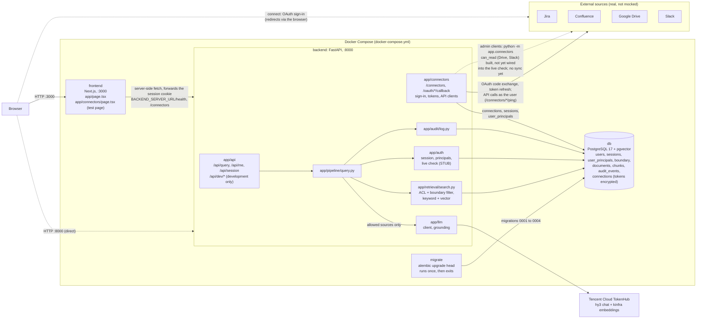

# Current architecture

What is built right now, not what is planned (see [ARCHITECTURE.md](ARCHITECTURE.md)
and [DECISIONS.md](../decisions/DECISIONS.md)). Only components that exist in code
or config appear here. Any PR that adds, removes or rewires a component updates
this diagram.

Details and contracts: [QUERY_PIPELINE.md](QUERY_PIPELINE.md). Connectors sign
users in and record their principals, but do not sync yet; documents come from
the development seed (`app/seed.py`).
