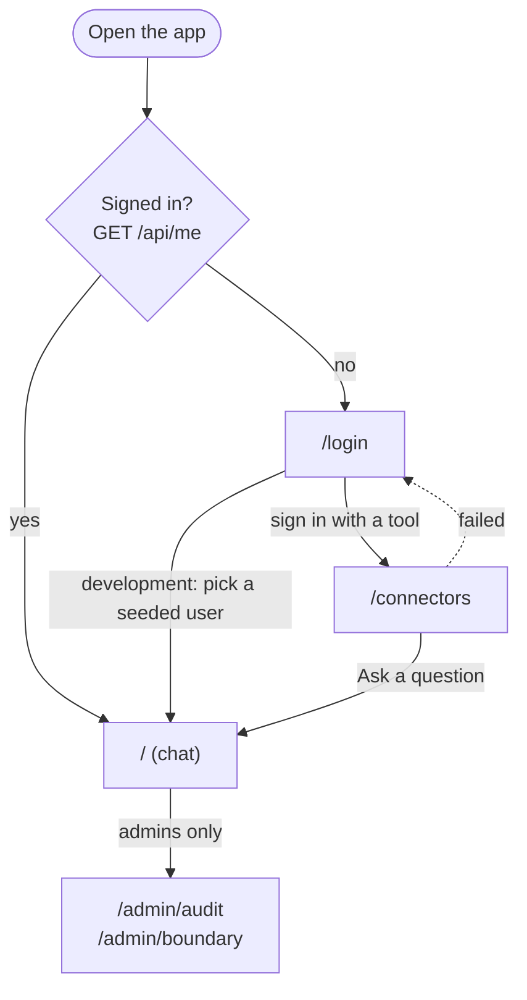

# The frontend

**For:** anyone changing pages, or wanting to know how the website talks to the backend and keeps people's data safe.
**You'll:** see every page, how sign-in and the session gate work, how answers are shown, and the design and
accessibility rules.
**Not here:** commands, folders and styling conventions → [frontend/README.md](../../frontend/README.md) ·
checking it by hand → [TESTING.md](../TESTING.md) · the backend → [ARCHITECTURE.md](../ARCHITECTURE.md).

The frontend never decides who may see what: the backend filters by permission before anything reaches the LLM
([SECURITY.md](../SECURITY.md), INV-2). File paths below are relative to `frontend/`. The decisions behind this design
are ADR-009 in [DECISIONS.md](../decisions/DECISIONS.md).

**Contents:** Pages · Sign-in · Chat · Admin pages · Talking to the backend · Design principles · Accessibility

## Pages

| Route | What it shows |
|---|---|
| `/` | Signed in only. The chat (see below) |
| `/login` | Sign-in with Google, Slack or Atlassian (links to the backend's OAuth); development sign-in box and Slack token form when the backend is in development mode |
| `/connectors` | Signed in only (it checks its own session, see Connections). Connect, test and disconnect Google Drive, Slack, Jira and Confluence. The page the OAuth callback returns to |
| `/admin/audit` | Admins only. Stub: the audit API now exists; this page is next (see "Admin pages") |
| `/admin/boundary` | Admins only. Stub: the boundary API now exists; this page is next |
| `/status` | The backend's `/health` (database, pgvector), fetched server-side from `BACKEND_SERVER_URL`. For developers |
| `/healthz` | `200 ok` without calling the backend. Used by the Docker health check |
| `/api/*` | Not a page: forwards to the backend (see below) |

### Page map



Every OAuth sign-in returns to `/connectors` (the backend fixes that target),
so a successful sign-in lands there, with an "Ask a question" link to the chat. Non-admins who open an admin page are sent back to the chat, and **Sign out** (in the account menu)
returns to `/login`.

## Sign-in

There is no app login form and no password (ADR-002): signing in means
connecting a tool, handled by the backend's OAuth (`backend/app/connectors`).
The first connection creates your user and session. **Your company comes from
a Slack workspace**, never from Google or Atlassian: the first full member (not
a guest) to sign in from a new workspace creates the company and becomes its
admin. An Atlassian sign-in only joins a company whose admin has added that
site, and a user with only Google has no company and sees nothing.

- **Session gate.** `app/(app)/layout.tsx` calls `GET /api/me` on the server
  for every signed-in page. 401 → `/login`. Backend unreachable → "Can't reach
  the server" (not a redirect, which would look like being signed out). The
  user is passed to client components through `MeProvider` (`useMe()`), for
  display only. This gate is UX: the backend checks the session on every call.
- **`/login`.** Signed-in visitors go to `/`. "Sign in with Google", "Slack"
  and "Atlassian" are plain links to
  `${BACKEND_LOCAL_URL}/connectors/{drive,slack,jira}/connect`: a full-page
  navigation, never a `fetch`, because the OAuth redirect has to start and end
  on the backend. If a provider is not configured the backend answers 503 and
  names the missing variable.
- **Errors.** The backend's OAuth callback redirects to
  `/connectors?connected=<provider>` or `/connectors?error=<code>` (the target
  is fixed in the backend). Only the codes in `lib/connectors.ts`
  (`access_denied`, `provider_error`, `invalid_state`, `account_mismatch`,
  `no_company`, `missing_permission`) have a message; any other value shows
  nothing, so a crafted link cannot put its own text on a page. A failed
  sign-in has no session, so `/connectors` carries a known error on to
  `/login?error=<code>`, where the person is trying to sign in.
- **Pages that read the session must render per request.** Call
  `await connection()` first, and start every server-side `catch` with
  `unstable_rethrow(error)`. Next.js signals "this page is dynamic" and
  `redirect()` by throwing; catching those by mistake made a production build
  bake the signed-in page as a fixed "Can't reach the server" page.
- **Sign out.** User menu → `DELETE /api/session` → full page load to
  `/login`. If the request fails, the menu says so and the user stays signed in.

### Connections (`/connectors`)

`app/connectors/page.tsx`, `components/connectors/`. One card per tool: status
and the connected account, then **Connect** (a link to the backend), or **Test**
and **Disconnect**.

- **Own session check, not the `(app)` layout.** The layout would send a
  signed-out visitor to `/login` and lose the `?error=` code. The page shares
  the frame (`components/signed-in-shell.tsx`) with the layout.
- **Test and Disconnect are server actions** (`app/connectors/actions.ts`).
  They call `GET /connectors/{id}/ping` and `DELETE /connectors/{id}`, which sit
  outside `/api`, through `backendFetch()` in `lib/api/server.ts`, forwarding the
  visitor's cookie. Server actions are public endpoints, so the connector id is
  checked against the fixed list first (`isConnectorId`). Jira and Confluence
  share one Atlassian sign-in: disconnecting either removes both.
- **Company hint.** A user with connections but none of Slack, Jira or
  Confluence is told to connect one to join their company. (`/api/me` does not
  say whether you have a company; a field for it is on the wish list.)
- **Slack token form, development only.** Slack's OAuth needs https, so while the
  backend runs with `APP_ENV=development` a labelled form connects Slack with a
  pasted user token (`POST /api/dev/connectors/slack`). The form appears only
  when the backend lists `/api/dev/users`; there is no frontend `APP_ENV`.

### Development sign-in (persona switcher)

DEVELOPMENT ONLY, and labelled as such on screen. Identity is not verified.

- Shown only when the backend lists `GET /api/dev/users`, which exists only with
  `APP_ENV=development` in `backend/.env`. There is no frontend flag: with
  `APP_ENV=production` the routes return 404 and every development control
  disappears (checked).
- `/login` lists the seeded users (`docker compose run --rm backend python -m app.seed`);
  names come from the backend, none are hard-coded. They belong to fictional
  companies (MerlionPay, and Dana in Kopi Labs, to show company isolation).
  Personas have no real connection, so in development their questions use the
  stored-permission check instead of asking Slack or Drive live.
- Signed-in pages show an amber "Development tools" strip with the current user
  and a **Switch user** menu.
- Signing in or switching does a **full page load**, so nothing from the
  previous person (such as chat history) survives (SECURITY.md T6).

## Chat (`/`)

Code: `components/chat/`. Each question is answered on its own: the backend
receives only `{question}`, never earlier questions or answers, so a follow-up
such as "what about last week?" has no context. History exists only in the
browser's memory for this page load (never `localStorage`) and is wiped by the
full page load on sign-out or user switch (SECURITY.md T6).

| State | When | What the user sees |
|---|---|---|
| Pending | Request in flight (about 3–5 s with the real LLM since hy3's hidden reasoning was turned off) | "Searching your sources…" with a skeleton. No invented progress steps |
| Answered | 200, not a fixed sentence | Answer as plain text (`[S1]` markers removed), Sources list, `Ref #<audit_id>` |
| Not found | 200, the fixed "I could not find this…" sentence | Muted card. **Identical whether nothing exists or nothing is permitted** (INV-5) |
| Unavailable | 200, the fixed "The assistant is unavailable…" sentence | Warning with Try again |
| Failed | 422, 503, other 5xx, backend unreachable | Short message with Try again (re-sends the same question in place) |
| Signed out | 401 | Full page load to `/login`; the draft is not kept |

Rules:
- **Answers are plain text**, never HTML: they come from untrusted retrieved
  content.
- **Only absolute `http(s)` source URLs become links**, in a new tab with
  `noopener noreferrer`; anything else is shown as plain text.
- **Example questions are generic.** They are shown to every user, so naming
  a real document would reveal that it exists (INV-5).
- One question at a time; the box stays editable while an answer is pending.
  Enter sends, Shift+Enter adds a line, and Enter is ignored while an input
  method (Chinese, Japanese, ...) is composing.
- Screen readers hear only the newest result (one polite live region). Focus
  returns to the question box after each answer. The thread follows new
  answers unless the reader has scrolled up.

### Checking the chat by hand

The persona-by-persona checks with expected answers, and the states that can only be triggered in mock mode:
[docs/TESTING.md](../TESTING.md) sections 4 and 6.

## Admin pages (stubs)

`app/(app)/admin/`. ADR-007: one admin role, which also does compliance.

- **Gate.** `app/(app)/admin/layout.tsx` sends non-admins back to the chat;
  the header shows Chat and Connections for everyone and Audit / Boundary for
  admins (in the user menu below 640 px). Both are UX only: every admin API
  route checks `is_admin` itself and returns 403.
- **Not built yet.** Each page says so in a "Not built yet" panel:
  - `/admin/audit`: the API exists since PR #11 (`backend/app/audit/api.py`):
    `GET /api/admin/audit` (search: `user`, `since`, `until`, `event_type`,
    `document`, `source`, `scope_id`, `before_id`, `limit`; returns
    `{records, next_before_id}`) and `POST /api/admin/audit/verify` (hash
    chain). This page is next.
  - `/admin/boundary`: the API exists since PR #4
    (`backend/app/connectors/admin.py`): `GET /api/admin/scopes/{source}`,
    `GET /api/admin/boundary`, `PUT` and `DELETE
    /api/admin/boundary/{source}/{scope_id}`, and `POST /api/admin/sync` (202,
    nothing to poll). This page is next; until then an admin uses
    http://localhost:8000/docs ([RUNNING.md](../RUNNING.md) §5).
- **Design preview (development only).** "Show design preview" reveals the
  planned layout inside a dashed **MOCK DATA** frame. Filters, Verify chain
  and Sync now are disabled, and confirming a boundary removal does nothing.
  It only appears while the backend is in development mode. Fixtures live in
  `lib/mock/`; the audit ones copy the payload keys the backend writes today
  (`backend/app/pipeline/query.py`), so the real wiring should be a swap.
- Documents are shown by key (`drive:D_Q3_INCIDENT`), not title, until the
  team decides whether the admin may see titles of documents they cannot
  read (an open question, listed in [frontend/README.md](../../frontend/README.md)).

## Talking to the backend

```
browser ──/api/*──▶ frontend proxy (app/api/[...path]/route.ts) ──▶ BACKEND_SERVER_URL/api/*
server components ──lib/api/server.ts──▶ BACKEND_SERVER_URL/api/*  (forwards the request's Cookie header)
```

- **The browser only talks to the frontend's origin.** The `/api/*` route
  handler forwards each request to `BACKEND_SERVER_URL`, so the backend's httpOnly
  `ib_session` cookie is set for this origin and no CORS setup is needed.
  It is a route handler, not a `next.config.ts` rewrite: a test build showed
  rewrites capture `BACKEND_SERVER_URL` at build time, while Docker sets it at run time.
- **The proxy decides nothing.** It forwards only `content-type`, `accept` and
  `cookie`, cannot leave `/api`, takes its host only from `BACKEND_SERVER_URL`,
  passes every `Set-Cookie` back, and never retries. Backend unreachable:
  `502`; slower than 30 s: `504`.
- **Never call `fetch` for the backend directly.** Client components use
  `lib/api/client.ts`; server components and layouts use `lib/api/server.ts`.
  Both throw `NotSignedInError` (401), `BackendUnreachableError` (network,
  502, 504) or `ApiError` (`lib/api/errors.ts`).
- **No function takes a user ID.** Who is asking comes only from the session
  cookie (SECURITY.md INV-3). `askQuestion` sends exactly `{question}`.
- **Development mode comes from the backend:** `listDevUsers()` on the server
  returns `null` when `/api/dev/users` does not exist (backend not in
  `APP_ENV=development`), and every development-only control is hidden.

### API types

`lib/api/schema.d.ts` is generated from the backend's `/openapi.json`; never
edit it by hand. With the backend running locally in development mode (so the
dev routes are included), from `frontend/`:

```
npm run gen:api-types
```

Rerun it whenever a backend route or response changes, and commit the result.
`lib/api/types.ts` gives the generated types friendly names.

### Answers, citations and links

- `lib/answers.ts`: the backend's two fixed replies, copied exactly, and
  `classifyAnswer()` (`answered` / `notFound` / `unavailable`). The only file
  to change if the backend wording changes.
- `lib/citations.ts`: `stripCitationMarkers()` removes `[S1]` markers (citations
  do not yet say which label they are); `safeHttpUrl()` returns a URL only if
  it is absolute `http(s)`. Answer text and source URLs are untrusted: render
  answers as plain text and link only what `safeHttpUrl` accepts.
- `lib/format.ts`: relative and exact timestamps, in the viewer's locale
  (client components only).

### Mock mode (development only)

`NEXT_PUBLIC_API_MOCK=1` fakes `askQuestion` (`POST /api/query`) with labelled fixtures from `lib/api/mock.ts`, so
the chat states can be built without spending LLM tokens. It is ignored in production builds. How to use it:
[docs/TESTING.md](../TESTING.md) section 6.

## Design principles

The product's claim is trust: answers from your own tools, limited to what you
can already see, with a record of everything. The design shows that rather
than explaining it.

1. **Provenance first.** Every answer shows where it came from (platform,
   title, last updated). Sources are not a footnote.
2. **Calm, not chatty.** An enterprise tool: no avatar or personality for the
   assistant, system fonts, thin borders, motion only for the pending state.
3. **Honest states.** "Not found" is a normal, neutral outcome: never red,
   never "denied", identical whatever the reason.
4. **Development aids look like development aids.** The persona switcher, mock
   mode and design previews are amber and labelled, so they cannot be mistaken
   for features in screenshots or the demo.
5. **Works side by side.** Layouts hold at ~640 px, so two personas can be
   shown next to each other in the demo, and at 375 px on a phone.

## Accessibility

Target: WCAG 2.2 AA. Checked on 4 Oct with axe-core (the engine behind
Lighthouse's accessibility audit) on every page and every chat state, light
and dark: no violations. How to check: [docs/TESTING.md](../TESTING.md) section 5.

- **Keyboard.** The first Tab stop is "Skip to content". Every control has a
  visible focus ring. Menus open with Enter, move with the arrow keys and
  close with Escape back to their button. Dialogs and panels return focus to
  whatever opened them.
- **Screen readers.** Landmarks for the banner, the main navigation and the
  page; the conversation is a list of "You asked" plus an "Answer" article.
  One polite live region says only the newest result ("Answer received, with
  2 sources", or the fixed reply). Badges and states always carry text, never
  colour alone. Links that open a new tab say so.
- **Contrast.** Every text pair meets 4.5:1 and input borders 3:1 (see the
  theme rules in [frontend/README.md](../../frontend/README.md)).
- **Touch.** On touch screens, controls are at least 44×44 px.
- **Zoom and motion.** No page scrolls sideways at 375 px or 640 px (the width
  of a 1280 px screen at 200 % zoom); wide tables scroll inside their own box.
  Animations stop under `prefers-reduced-motion`.

Not checked by a person yet: a full pass with VoiceOver or NVDA.
