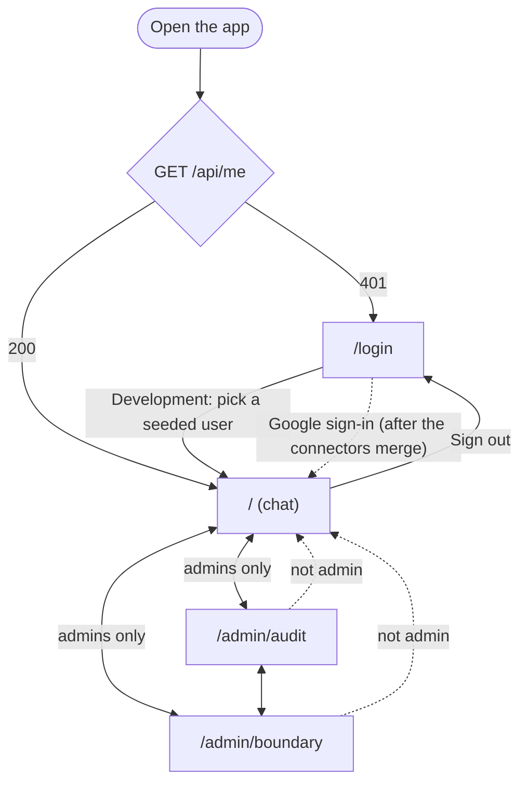

# frontend/

Next.js app (see DECISIONS.md, ADR-001). Status: sign-in (Google, Slack and
Atlassian through the backend's OAuth, plus the development persona switcher),
the chat, the Connections page and the signed-in shell work; the admin pages
are honest stubs (the audit API does not exist yet; the boundary API does, and
that page is next).

The frontend never makes authorization decisions; the backend filters by
permission before anything reaches the LLM (SECURITY.md, INV-2). Frontend tests
live in this folder.

## Stack

| Piece | What it is for |
|---|---|
| Next.js 16 (App Router) | Pages and server-side calls to the backend |
| Tailwind CSS v4 | Styling, compiled at build time (`postcss.config.mjs`) |
| shadcn/ui (Radix base, Nova preset) | Accessible components, copied into `components/ui/` |
| next-themes | System / Light / Dark theme, no flash on load |
| lucide-react | Icons (generic icons only, no brand logos) |

## Pages

| Route | What it shows |
|---|---|
| `/` | Signed in only. The chat (see below) |
| `/login` | Sign-in with Google, Slack or Atlassian (links to the backend's OAuth); development sign-in box when the backend is in development mode |
| `/connectors` | Signed in only (it checks its own session, see Connections). Connect, test and disconnect Google Drive, Slack, Jira and Confluence. The page the OAuth callback returns to |
| `/admin/audit` | Admins only. Stub: waits for the audit API (see "Admin pages") |
| `/admin/boundary` | Admins only. Stub: the boundary API now exists; this page is next |
| `/status` | The backend's `/health` (database, pgvector), fetched server-side from `BACKEND_SERVER_URL`. For developers |
| `/healthz` | `200 ok` without calling the backend. Used by the Docker health check |
| `/api/*` | Not a page: forwards to the backend (see below) |

### Page map



`/connectors` (connect Slack, Drive, Jira, Confluence) joins the map once the
connectors branch merges; until then it is not linked.

## Sign-in

There is no app login form and no password (ADR-002): signing in means
connecting a tool, handled by the backend's OAuth (`backend/app/connectors`).
The first connection creates your user and session. **Your company comes from
a Slack workspace or Atlassian site**, never from Google: the first sign-in
from a new workspace or site creates a company and its first member becomes
admin, and a user with only Google has no company and sees nothing.

- **Session gate.** `app/(app)/layout.tsx` calls `GET /api/me` on the server
  for every signed-in page. 401 → `/login`. Backend unreachable → "Can't reach
  the server" (not a redirect, which would look like being signed out). The
  user is passed to client components through `MeProvider` (`useMe()`), for
  display only. This gate is UX: the backend checks the session on every call.
- **`/login`.** Signed-in visitors go to `/`. "Sign in with Google", "Slack"
  and "Atlassian" are plain links to
  `${BACKEND_LOCAL_URL}/connectors/{drive,slack,jira}/connect`: a full-page
  navigation, never a `fetch`, because the OAuth redirect has to start and end
  on the backend. If a provider is not configured the backend answers 503 and
  names the missing variable.
- **Errors.** The backend's OAuth callback redirects to
  `/connectors?connected=<provider>` or `/connectors?error=<code>` (the target
  is fixed in the backend). Only the codes in `lib/connectors.ts`
  (`access_denied`, `provider_error`, `invalid_state`, `account_mismatch`,
  `no_company`, `missing_permission`) have a message; any other value shows
  nothing, so a crafted link cannot put its own text on a page. A failed
  sign-in has no session, so `/connectors` carries a known error on to
  `/login?error=<code>`, where the person is trying to sign in.
- **Pages that read the session must render per request.** Call
  `await connection()` first, and start every server-side `catch` with
  `unstable_rethrow(error)`. Next.js signals "this page is dynamic" and
  `redirect()` by throwing; catching those by mistake made a production build
  bake the signed-in page as a fixed "Can't reach the server" page.
- **Sign out.** User menu → `DELETE /api/session` → full page load to
  `/login`. If the request fails, the menu says so and the user stays signed in.

### Connections (`/connectors`)

`app/connectors/page.tsx`, `components/connectors/`. One card per tool: status
and the connected account, then **Connect** (a link to the backend), or **Test**
and **Disconnect**.

- **Own session check, not the `(app)` layout.** The layout would send a
  signed-out visitor to `/login` and lose the `?error=` code. The page shares
  the frame (`components/signed-in-shell.tsx`) with the layout.
- **Test and Disconnect are server actions** (`app/connectors/actions.ts`).
  They call `GET /connectors/{id}/ping` and `DELETE /connectors/{id}`, which sit
  outside `/api`, through `backendFetch()` in `lib/api/server.ts`, forwarding the
  visitor's cookie. Server actions are public endpoints, so the connector id is
  checked against the fixed list first (`isConnectorId`). Jira and Confluence
  share one Atlassian sign-in: disconnecting either removes both.
- **Company hint.** A user with connections but none of Slack, Jira or
  Confluence is told to connect one to join their company. (`/api/me` does not
  say whether you have a company; a field for it is on the wish list.)
- **Slack token form, development only.** Slack's OAuth needs https, so while the
  backend runs with `APP_ENV=development` a labelled form connects Slack with a
  pasted user token (`POST /api/dev/connectors/slack`). The form appears only
  when the backend lists `/api/dev/users`; there is no frontend `APP_ENV`.

### Development sign-in (persona switcher)

DEVELOPMENT ONLY, and labelled as such on screen. Identity is not verified.

- Shown only when the backend lists `GET /api/dev/users`, which exists only with
  `APP_ENV=development` in `backend/.env`. There is no frontend flag: with
  `APP_ENV=production` the routes return 404 and every development control
  disappears (checked).
- `/login` lists the seeded users (`docker compose run --rm backend python -m app.seed`);
  names come from the backend, none are hard-coded. They belong to fictional
  companies (MerlionPay, and Dana in Kopi Labs, to show company isolation).
  Personas have no real connection, so in development their questions use the
  stored-permission check instead of asking Slack or Drive live.
- Signed-in pages show an amber "Development tools" strip with the current user
  and a **Switch user** menu.
- Signing in or switching does a **full page load**, so nothing from the
  previous person (such as chat history) survives (SECURITY.md T6).

## Chat (`/`)

Code: `components/chat/`. Each question is answered on its own: the backend
receives only `{question}`, never earlier questions or answers, so a follow-up
such as "what about last week?" has no context. History exists only in the
browser's memory for this page load (never `localStorage`) and is wiped by the
full page load on sign-out or user switch (SECURITY.md T6).

| State | When | What the user sees |
|---|---|---|
| Pending | Request in flight (~6–9 s with the real LLM) | "Searching your sources…" with a skeleton. No invented progress steps |
| Answered | 200, not a fixed sentence | Answer as plain text (`[S1]` markers removed), Sources list, `Ref #<audit_id>` |
| Not found | 200, the fixed "I could not find this…" sentence | Muted card. **Identical whether nothing exists or nothing is permitted** (INV-5) |
| Unavailable | 200, the fixed "The assistant is unavailable…" sentence | Warning with Try again |
| Failed | 422, 503, other 5xx, backend unreachable | Short message with Try again (re-sends the same question in place) |
| Signed out | 401 | Full page load to `/login`; the draft is not kept |

Rules:
- **Answers are plain text**, never HTML: they come from untrusted retrieved
  content.
- **Only absolute `http(s)` source URLs become links**, in a new tab with
  `noopener noreferrer`; anything else is shown as plain text.
- **Example questions are generic.** They are shown to every user, so naming
  a real document would reveal that it exists (INV-5).
- One question at a time; the box stays editable while an answer is pending.
  Enter sends, Shift+Enter adds a line, and Enter is ignored while an input
  method (Chinese, Japanese, ...) is composing.
- Screen readers hear only the newest result (one polite live region). Focus
  returns to the question box after each answer. The thread follows new
  answers unless the reader has scrolled up.

### Demo script (manual test)

Sign in through the persona switcher with seed data loaded. Answers depend on
the LLM: check the state and the sources, not the exact wording. Needs
`LLM_BASE_URL`, `LLM_API_KEY` and `LLM_MODEL` in `backend/.env` (values in
`backend/.env.example`), then `docker compose up -d --force-recreate backend`;
if any is missing, every question shows "The assistant isn't available right
now" (the backend returns 503 before searching). Checked 4 Oct with the real
LLM: all seven rows below behaved as expected.

| Persona | Question | Expected |
|---|---|---|
| Alice | What's blocking the payment gateway migration? | Answer citing `#payments-oncall` (Slack) |
| Alice | What does the runbook say about failover? | Answer citing the Drive runbook and/or `#eng` |
| Ben | What's blocking the payment gateway migration? | Less, or "not found" (not in `#payments-oncall`) |
| Charlie | What happened in the Q3 security incident? | Fixed "not found" (scenario 3) |
| Priya | What happened in the Q3 security incident? | Answer citing the incident report and/or `#security-incidents` |
| anyone | What are the salary bands? | Fixed "not found" (folder outside the admin boundary) |
| anyone | asdkjh qwe | Fixed "not found", looking identical to Charlie's |

Also: stop the backend → "Couldn't reach the server"; sign out in another tab
→ the next question goes to `/login`. States that cannot be triggered on
demand (unavailable, 422, a `javascript:` source URL, very long answers) are
checked in mock mode with `mock:unavailable`, `mock:422`, `mock:bad-url`,
`mock:long`.

## Admin pages (stubs)

`app/(app)/admin/`. ADR-007: one admin role, which also does compliance.

- **Gate.** `app/(app)/admin/layout.tsx` sends non-admins back to the chat;
  the header shows Chat for everyone and Audit / Boundary for admins (in the
  user menu below 640 px). Both are UX only: every admin API route must check
  `is_admin` itself and return 403.
- **Not built yet.** No admin API exists on any branch (4 Oct). Each page says
  so in a "Not built yet" panel naming the routes it waits for (proposed in
  the UI plan, section 6.5):
  - `/admin/audit`: `GET /api/admin/audit` (search) and
    `POST /api/admin/audit/verify` (hash chain), Task 3, 5–6 Oct.
  - `/admin/boundary`: `GET`/`POST`/`DELETE /api/admin/boundary` and
    `POST /api/admin/sync`, owners to be agreed.
- **Design preview (development only).** "Show design preview" reveals the
  planned layout inside a dashed **MOCK DATA** frame. Filters, Verify chain
  and Sync now are disabled, and confirming a boundary removal does nothing.
  It only appears while the backend is in development mode. Fixtures live in
  `lib/mock/`; the audit ones copy the payload keys the backend writes today
  (`backend/app/pipeline/query.py`), so the real wiring should be a swap.
- Documents are shown by key (`drive:D_Q3_INCIDENT`), not title, until the
  team decides whether the admin may see titles of documents they cannot
  read (UI plan question log, Q15).

## Talking to the backend

```
browser ──/api/*──▶ frontend proxy (app/api/[...path]/route.ts) ──▶ BACKEND_SERVER_URL/api/*
server components ──lib/api/server.ts──▶ BACKEND_SERVER_URL/api/*  (forwards the request's Cookie header)
```

- **The browser only talks to the frontend's origin.** The `/api/*` route
  handler forwards each request to `BACKEND_SERVER_URL`, so the backend's httpOnly
  `ib_session` cookie is set for this origin and no CORS setup is needed.
  It is a route handler, not a `next.config.ts` rewrite: a test build showed
  rewrites capture `BACKEND_SERVER_URL` at build time, while Docker sets it at run time.
- **The proxy decides nothing.** It forwards only `content-type`, `accept` and
  `cookie`, cannot leave `/api`, takes its host only from `BACKEND_SERVER_URL`,
  passes every `Set-Cookie` back, and never retries. Backend unreachable:
  `502`; slower than 30 s: `504`.
- **Never call `fetch` for the backend directly.** Client components use
  `lib/api/client.ts`; server components and layouts use `lib/api/server.ts`.
  Both throw `NotSignedInError` (401), `BackendUnreachableError` (network,
  502, 504) or `ApiError` (`lib/api/errors.ts`).
- **No function takes a user ID.** Who is asking comes only from the session
  cookie (SECURITY.md INV-3). `askQuestion` sends exactly `{question}`.
- **Development mode comes from the backend:** `listDevUsers()` on the server
  returns `null` when `/api/dev/users` does not exist (backend not in
  `APP_ENV=development`), and every development-only control is hidden.

### API types

`lib/api/schema.d.ts` is generated from the backend's `/openapi.json`; never
edit it by hand. With the backend running locally in development mode (so the
dev routes are included), from `frontend/`:

```
npm run gen:api-types
```

Rerun it whenever a backend route or response changes, and commit the result.
`lib/api/types.ts` gives the generated types friendly names.

### Answers, citations and links

- `lib/answers.ts`: the backend's two fixed replies, copied exactly, and
  `classifyAnswer()` (`answered` / `notFound` / `unavailable`). The only file
  to change if the backend wording changes.
- `lib/citations.ts`: `stripCitationMarkers()` removes `[S1]` markers (citations
  do not yet say which label they are); `safeHttpUrl()` returns a URL only if
  it is absolute `http(s)`. Answer text and source URLs are untrusted: render
  answers as plain text and link only what `safeHttpUrl` accepts.
- `lib/format.ts`: relative and exact timestamps, in the viewer's locale
  (client components only).

### Mock mode (development only)

Builds the chat states without spending LLM tokens. Add
`NEXT_PUBLIC_API_MOCK=1` to `frontend/.env` and restart `npm run dev`.

- Only `askQuestion` (`POST /api/query`) is mocked; sign-in and `/api/me` stay
  real, so the backend must be running.
- A keyword in the question picks the reply: `mock:answered` (default),
  `mock:long`, `mock:markers`, `mock:bad-url`, `mock:no-citations`,
  `mock:not-found`, `mock:unavailable`, `mock:401`, `mock:422`, `mock:503`,
  `mock:offline`. Replies take ~6 s; add `mock:fast` to skip the delay.
- A **MOCK DATA** badge shows in the header, and mocked answers have
  `audit_id` 0 (never audited).
- Ignored in production builds (`next build`), so Docker images and the live
  site cannot run it. Fixtures live in `lib/api/mock.ts`.

## Tests

From `frontend/`: `npm test` (Vitest). Tests sit next to the code
(`*.test.ts`) and are named after behaviour. They cover the security-relevant
helpers: fixed-reply classification, link safety, marker stripping, and mock
mode staying off in production.

## Folders

```
app/(app)/            signed-in pages; layout.tsx is the session gate
app/connectors/       Connections page and its server actions
app/(public)/         /login and /status, no session needed
app/api/[...path]/    the /api proxy to the backend
app/                  root layout.tsx (theme), globals.css, healthz/
components/ui/        shadcn-generated components: edit freely, keep them generic
components/           our own components, built from components/ui
components/connectors/  connection cards and the development-only Slack token form
components/admin/     admin stubs: NotBuiltYet, DesignPreview, audit and boundary previews
lib/mock/             DEVELOPMENT ONLY fixtures for the admin design previews
lib/api/              backend client (client.ts, server.ts), errors, generated types, mock mode
lib/                  answer, citation and date helpers; connectors.ts (connector ids, OAuth messages); utils.ts is shadcn's cn()
components.json       shadcn CLI settings
```

## Running

- With everything else: `docker compose up --build` from the repo root, then
  http://localhost:3000.
- Hot reload while editing: install Node 24 (same as the Docker image), then in
  `frontend/`: `npm ci` once and `npm run dev`. Use `npm run dev -- -p 3001`
  if the Docker frontend already holds port 3000.

## Theme and styling rules

- Colours are CSS variables in `app/globals.css` (light under `:root`, dark
  under `.dark`), using shadcn's names. Use them through Tailwind classes
  (`bg-card`, `text-muted-foreground`, `border-input`, `bg-warning`); never
  hard-code a colour in a component.
- Our brand colour is `--primary`. shadcn's `--accent` is the hover
  background, not the brand colour.
- `--destructive` is for genuine failures only. A "not found" answer is never
  red.
- `--warning` is for "unavailable", development-only aids and mock data.
- Input borders use `--input`, which meets 3:1 contrast; `--border` is for
  decorative edges only.
- Every text/background pair meets WCAG AA. Re-check contrast when changing a
  value.
- Animations are switched off under `prefers-reduced-motion`.

## Design principles

The product's claim is trust: answers from your own tools, limited to what you
can already see, with a record of everything. The design shows that rather
than explaining it.

1. **Provenance first.** Every answer shows where it came from (platform,
   title, last updated). Sources are not a footnote.
2. **Calm, not chatty.** An enterprise tool: no avatar or personality for the
   assistant, system fonts, thin borders, motion only for the pending state.
3. **Honest states.** "Not found" is a normal, neutral outcome: never red,
   never "denied", identical whatever the reason.
4. **Development aids look like development aids.** The persona switcher, mock
   mode and design previews are amber and labelled, so they cannot be mistaken
   for features in screenshots or the demo.
5. **Works side by side.** Layouts hold at ~640 px, so two personas can be
   shown next to each other in the demo, and at 375 px on a phone.

## Accessibility

Target: WCAG 2.2 AA. Checked on 4 Oct with axe-core (the engine behind
Lighthouse's accessibility audit) on every page and every chat state, light
and dark: no violations.

- **Keyboard.** The first Tab stop is "Skip to content". Every control has a
  visible focus ring. Menus open with Enter, move with the arrow keys and
  close with Escape back to their button. Dialogs and panels return focus to
  whatever opened them.
- **Screen readers.** Landmarks for the banner, the main navigation and the
  page; the conversation is a list of "You asked" plus an "Answer" article.
  One polite live region says only the newest result ("Answer received, with
  2 sources", or the fixed reply). Badges and states always carry text, never
  colour alone. Links that open a new tab say so.
- **Contrast.** Every text pair meets 4.5:1 and input borders 3:1 (see the
  theme rules above).
- **Touch.** On touch screens, controls are at least 44×44 px.
- **Zoom and motion.** No page scrolls sideways at 375 px or 640 px (the width
  of a 1280 px screen at 200 % zoom); wide tables scroll inside their own box.
  Animations stop under `prefers-reduced-motion`.

Not checked by a person yet: a full pass with VoiceOver or NVDA.

## Planned next (not built)

| Waiting on | UI work |
|---|---|
| Connectors branch merges | Enable "Sign in with Google" (a plain link to the backend's `/connectors/drive/connect`); rename `BACKEND_URL` to `BACKEND_SERVER_URL` and add `BACKEND_LOCAL_URL`; restyle `/connectors` inside the signed-in shell (with its owner); show which sources are connected in the chat |
| Return target after the OAuth callback | Show sign-in errors on `/login` rather than `/connectors`. The target must come from a fixed allowlist, never an arbitrary URL (open redirect) |
| `label` on each citation | Turn `[S1]` markers into chips linked to the right source (today they are stripped: an answer citing `[S1]` and `[S3]` came back with two citations, so mapping by position would be wrong) |
| `status` on query responses | Classify answers by status instead of matching the fixed sentences |
| Audit API | Real `/admin/audit` (search, record detail, verify chain); make "Ref #" a link for admins |
| Boundary and sync API | Real `/admin/boundary`; "Sync now" for the freshness demo (scenario 2) |
| Freshness field | "Synced N minutes ago" under answers |
| Redaction and injection flags (7–8 Oct) | Redaction chip on citations; blocked-injection notice on answers |

Each replaces a stub or a reserved slot; remove the matching "Not built yet"
panel and design preview in the same PR.

**Deployment (ADR-008).** Outside `APP_ENV=development` the backend marks the
session cookie `Secure`, which browsers only send over HTTPS. The live site
must be served over HTTPS, or sign-in silently fails.

## Open questions

Raised while building the UI; answers belong in DECISIONS.md or the code.

| For | Question |
|---|---|
| Whole team | **Admin designation for real sign-in.** `create_user` always sets `is_admin = false`, so no Google user can become admin (e.g. an `ADMIN_EMAILS` list). Who builds it? |
| Whole team | May the audit page show titles of documents the admin cannot read? (ARCHITECTURE §3.12 vs ADR-007.) Until decided, documents are shown by key |
| Whole team | Who sets up HTTPS on the Lighthouse server? |
| Whole team | Demo accounts: which Gmails (listed in `GOOGLE_ALLOWED_ACCOUNTS` and as OAuth test users; Testing-mode tokens expire after 7 days). Contractor Google-only, since Slack guests need a paid plan? |
| Whole team | Linter/formatter is still open (ADR-001) |
| Query pipeline | Add `label` and `status` to the query response; should a 503 "LLM is not configured" become the fixed "unavailable" reply? |
| Query pipeline | Without an LLM configured, `/api/query` returns 503 before the pipeline runs, so the question is not audited. Should it be? |
| Query pipeline | Shape of the audit API (proposed: search, one record, verify) |
| Connectors | Merge timing; return target after sign-in; who styles `/connectors`; what happens when someone disconnects their last connection; can personal Gmail users get `google:domain:gmail.com` as a principal? |
| Connectors | Who owns the boundary and sync routes, and is there a sync worker for "Sync now"? |

## Adding a shadcn component

From `frontend/`: `npx shadcn@latest add <component>` (for example `card`).
It writes `components/ui/<component>.tsx` and may add a Radix dependency; list
any new dependency in the PR. Add components only when a page needs them.

## Dependency notes

- `shadcn` and `tw-animate-css` are dev dependencies: only their CSS is used,
  at build time. `npm audit` reports an advisory in the shadcn CLI's own tree
  (`braces`); it does not reach the app's runtime dependencies
  (`npm audit --omit=dev` is clean).
- `cn` is shadcn's class-name merger, published by the same npm account as the
  `shadcn` package.
- `openapi-typescript` and `vitest` are dev dependencies (type generation,
  tests). `@types/node` is `^24` to match the Node 24 runtime (Vitest 5 needs
  22 or newer).
